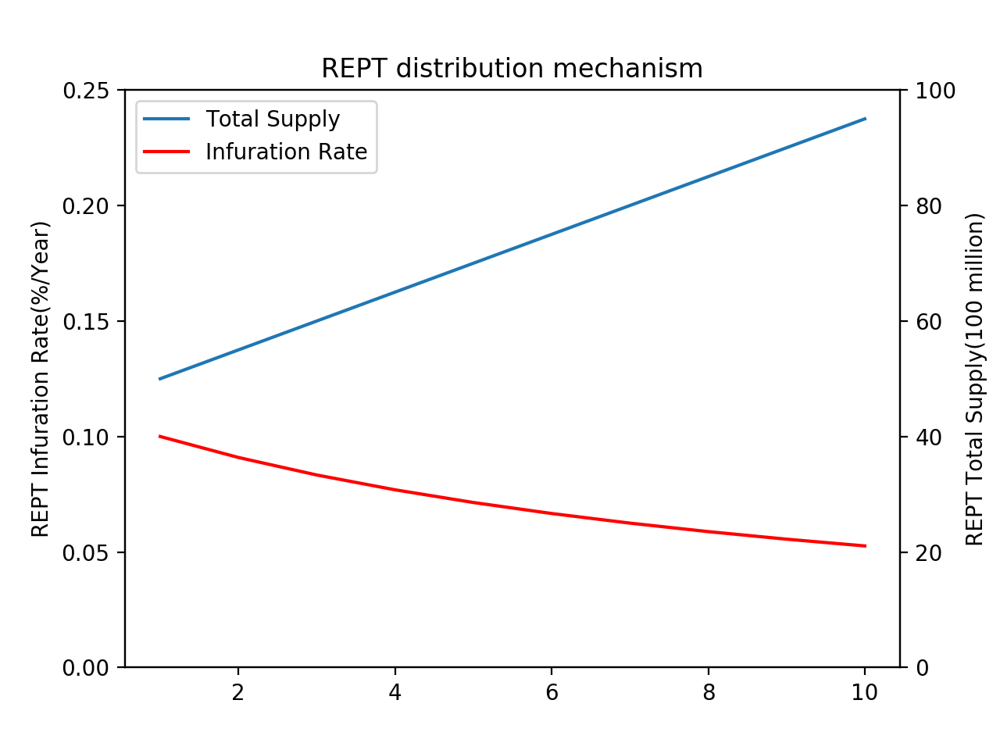
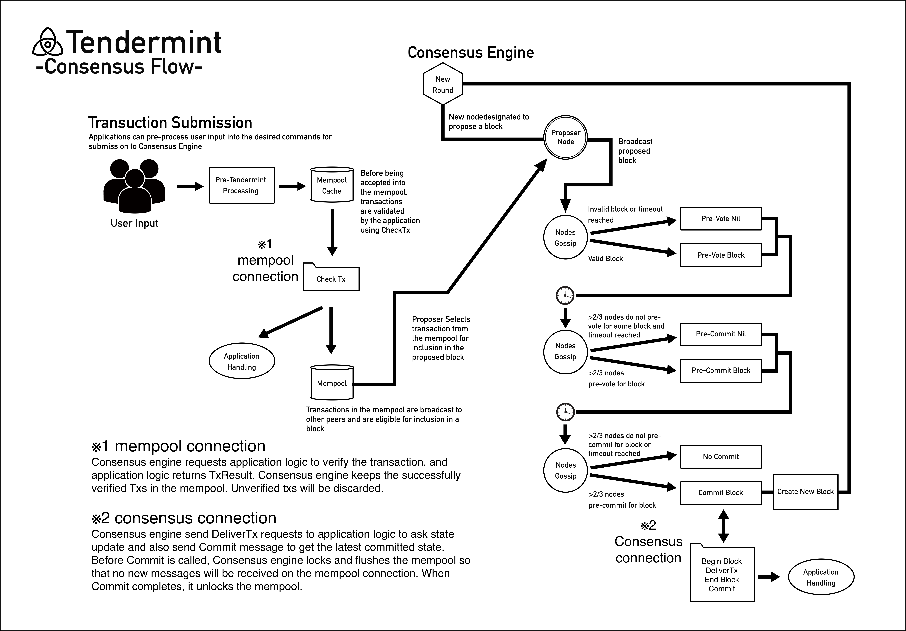

# <a id="top"></a>Nibiru Whitepaper

# <a id="abstract"></a>概要


Nibiru是一个公平安全的分布式游戏平台，支持新游戏的开发，并且可以更轻松地在游戏中交换物品，武器和装甲等有价值的数据。游戏中的物品，武器，装甲等将作为Nibiru链上唯一定义的通证（token）分发到市场，从而实现不需要第三方的交易。与传统的集中式游戏结构不同，Nibiru为游戏虚拟空间中的数据创造了新的价值，因为通证（token）所有权不属于游戏运营商。在虚拟空间中创造的新价值有可能在未来开始具有更现实的价值，并创造更大的经济效益。Nibiru的交易是公平的，可以由用户进行验证，并且由于资金流动可见，以对抗传统的货币伪造及双重转让等交易行为。传统的货币系统具有客户-服务器网络结构并且是集中支付系统，因此它易受诸如黑客攻击之类的外部攻击，并且许多费用用于金融监管和复杂处理。由于具有P2P网络结构的分布式货币系统可以说是非常安全，低负担的系统，因为信息不会停留在一个地方并且不依赖于第三方。

# <a id="introduction"></a>引言
## <a id="vision"></a>Our Vision

Nibiru允许用户自由管理他们的游戏内物品，武器，装甲和其他有价值的数据作为区块链上的数字资产，使他们能够自由，快速地进行交易。我们正在开发，旨在构建一个专门用于游戏的区块链网络。

我们相信，构建一个专门用于游戏的新分布式系统可以解决传统集中游戏产业所具有的“游戏空间中用户经济行为的约束”。
具体来说，Nibiru是一个非集中但可扩展的区块，可以通过高吞吐量实现快速终结，可以立即解决以改善基于区块链的游戏的用户体验。我们认为有必要发展一个链条，并实现这一目标。

此外，为了维持Nibiru链，我们希望通过为验证器建立适当的补偿系统来建立半永久性可持续的生态系统。


## <a id="principles"></a>Nibiru的基本思想
### <a id="sbp"></a> 游戏玩家如何受益

在传统的客户端-服务器游戏中，通过计费和游戏玩法获得的项目的所有权不归属于玩家而归属于管理服务器的游戏运营公司。因此，玩家不能根据自己的意图购买或出售游戏内物品，并且在游戏之间移动时持有的物品变得毫无价值。也就是说，为了在不同游戏之间保持用户的价值，需要具有玩家持有在游戏中获得的项目的所有权的机制。Nibiru游戏平台允许玩家通过将游戏内物品标记作为Nibiru区块链上的电磁信息保存在与游戏公司分开的空间中的物品标记。此外，玩家可以通过DEX将每个项目通证（token）与作为Nibiru平台上的分发货币的REPT交换，以便玩家在Nibiru平台上从游戏A转换到游戏B时拥有它。一旦使用REPT替换这些项目，将能够保留先前贬值的项目的价值，并且还将能够实质上启用RMT，而这些为游戏公司在之前所禁止的规则。在不断发展的游戏空间中管理数字资产创造了多样化的经济活动，使玩家能够享受更多自由和有吸引力的下一代分布式虚拟空间。

### <a id="sgdd"></a>游戏开发者如何在Nibiru上轻松开发
许多游戏开发人员都拥有游戏设计和开发技术，但由于资金问题导致无法继续进行开发。此外，对于传统的集中式主要游戏平台，由于它是一种商业模式，从游戏开发者那里收取相当于30％到50％的费用，所以开发游戏的高技能工程师以及开发者很难可以赚钱结构很难提高Nibiru提供属于具有传统结构的主要游戏制造商的中小型游戏公司和开发者，可以执行ICO，IEO，STO等作为开发原始游戏的Funding方法的机制。在Nibiru平台上，提供一种机制，可以以极低的成本轻松地发布游戏。此外，我们将准备一个SDK，以支持传统游戏开发者的所有功能，包括游戏中的项目通证（token）生成功能。

### <a id="pngg"></a>介绍下一代游戏的方式
在当前的游戏产业中，用户不能拥有游戏内数字资产的所有权，而属于他们的中小型游戏公司和开发商则转包给主要游戏制造商。也就是说，存在一种偏见的结构，其中一些主要的游戏制造商和集中的现有游戏平台很容易获利。此外，那些活跃在电子竞技运动中的职业玩家的数量也在不断增加，但总的来说，沉浸在游戏中只是娱乐，而且往往被视为逃避现实而没有生产力的手段。原因是游戏中花费的时间和金钱不会留给玩家的数字资产。如果在虚拟环境中花费的时间可以在现实世界中使用，那么从现在开始，预计游戏空间本身将越来越现实地开发，因为它将彻底改变人们观看游戏的方式。此外，在下一代游戏中，玩家将更加独立，有权正式声明其物品的所有权，并且可以通过电子竞技扩展在游戏中赚钱的职业玩家通常被接受。此外，属于实际进行游戏开发的中小型游戏公司的开发人员自主组织项目团队并在依靠主要游戏制造商的品牌力量的同时筹集资金，同时还可以使用技术开发创意游戏。在未来，随着娱乐的重要性和未来的多样化，随着玩家的独立性的提升，玩游戏的时代不再是消极的，游戏不仅仅是娱乐，甚至作为工作的一部分它会得到认可。分布式游戏平台可以是解决传统游戏行业所面临问题的新解决方案。下一代分布式虚拟空间，游戏爱好者可以真正活跃，游戏开发者可以自由创建满足玩家需求的新游戏，Nibiru也将开发出这些新游戏的世界。

# <a id="background"></a>背景
## <a id="egi"></a> 游戏产业发展
近年来，诸如多人在线对战竞技场（MOBA），第一人称射击（FPS）和角色扮演游戏（RPG）等大型多人在线（MMO）等PC游戏的市场规模继续大幅度的增加。此外，随着智能手机的普及和新技术的创新，手机游戏市场和VR游戏市场也在快速增长。

2015年全球游戏市场为931亿美元，2016年超过1065亿美元，2017年达到1217亿美元，2018年增长至1379亿美元。预计到2019年将达到1519亿美元，到2020年将达到1659亿美元，到2021年达到1801亿美元。互联网的发展促进了在线交流，并在游戏领域创造了多样化的社区。真实的游戏空间通过AR和VR技术实现，游戏越来越接近现实世界。


## <a id="ifcgi"></a> 当前游戏产业存在的问题
在传统的游戏结构下，游戏内物品由游戏管理方拥有，并且用户不能将游戏内物品作为其自己的资产。在单个游戏中获得的项目仅仅是游戏中的电磁信息，并且不可能在多个游戏之间移动该值。分配给游戏的时间和金钱只能在一个游戏空间内使用。此外，大多数运营公司明确禁止在服务条款上购买和销售游戏内物品，并且用户极难将具有超出单个游戏空间的价值的电磁信息作为资产。结果，用户在游戏空间中的经济行为受到限制。游戏中电磁值的转换称为RMT（RealMoneyTrading），但在许多现有的具有集中结构的游戏中，RMT明显被禁止。然而，预计该市场的潜在市场规模将达到数万亿日元或更多，并且存在大量需求。同样在游戏开发中，在现有框架中，披露游戏的方式仅限于集中式公司收取大量发布费用的少数手段，促进开发和创建更具吸引力的下一代虚拟空间因此，需要一种涉及电磁值传递和结算执行的游戏空间。Nibiru是虚拟世界中作为第二世界的分布式交易，通过在区块链上管理一些游戏内数据（例如用户所有权和项目特征）来分布式实现。玩家可以将游戏中的物品保留为数字资产，自由交易并享受利润，而不受中央权威限制或特定问题的约束。如今，世界上有趋势来创建一个专门用于RMT的交换，但是Nibiru不使用传统的集中式结构，而RMT是通过使用下一章描述的块链技术在分布式网络上执行的。下一代分布式虚拟空间将被创建为“一个玩家的，由玩家组成的，为了玩家服务的游戏平台”，构建机制并促进每个游戏爱好者的各种经济活动。

## <a id="egt"></a> 区块链技术的出现
比特币是由NakamotoSatoshi在2008年发表的白皮书「Bitcoin: A Peer-to-Peer Electronic Cash System」[<a href="#ref-1">1</a>]开发的，被认为是货币和货币的创新发明这是第一个没有中央货币控制机构而没有这种背景的数字资产的例子。作为比特币管理模式基础的区块链技术使得采用CPU的计算能力和简单的算法，可以通过分布式网络管理分类账。Ethereum（以太坊）[<a href="#ref-2">2</a>]是由以太坊基金会推动的开源项目，是具有图灵完整扩展语言的下一代智能合约分布式应用平台。比特币和以太坊所代表的是区主要加密货币都是区。通过加密电磁信息，时间戳，一致性算法和经济激励结构，每个节点处理P2P交易并管理分布式账本而无需相互信任，存在集中权限解决了高成本，低效率，电磁信息存储安全等问题。区块链本身并不是一项全新的技术，但可以说它是一种将P2P通信，加密技术和数据结构等结合在一起的创新技术。

# <a id="problems"></a>課題
##<a id="ifbi"></a> 区块链行业面临的挑战
分布式自治系统的发展吸引了更多人，区块链项目在全球范围内不断增加，许多应用正在开发中。随着从简单的电子货币到涉及智能合约的无基于应用的各种用例的出现以及基于Ripple的全球支付系统层的构建，区块链本身具有许多需求和挑战并且它也正在发生。与许多软件不同，不需要用户或客户端更新的分布式区块链可以利用协议更新来创建“硬分叉”或“软分叉”，从而导致社区的许多损失，并且该系统受到很大限制。在比特币，关于社区中块扩展的争议继续阻碍比特币协议的发展。比特币的区块链的有限容量导致超过一百万笔交易的保留，迫使用户支付额外的昂贵交易促销费用。在以太坊中，处理DAO问题的困难导致了社区的分裂和用户体验的恶化。世界对密码货币发起了投机热的情况下，出现了许多个不需要一个区块链实质上执行的广告炒作路线，这些问题是可以解决的使用情况，在未来实现分布式化社会是必需的。

## <a id="pcca"></a>当前共识算法存在的问题
为了解决引言中提到的游戏空间中用户经济行为的限制，获得具有高吞吐量的快速终结性，使得能够在非集中的情况下立即结算。为了实现构建可实现的可扩展的游戏特定区块链的愿景，目前广泛使用的共识算法（如PoW和PoS）是不够的。在PoW中，首先解决需要大量计算的哈希计算的节点被赋予创建区块的权限，然后通过每个节点的多数决定来执行所创建的区块的批准操作。然而，由于交易量的增加，PoW的难度增加将导致拥堵，如超级计算机或大型服务器之类的高规格机器用于区块批准工作的问题，并且将需要巨大的功耗。存在例如51％等问题的影响。尤其是需要通过不特定的多个批准工作，必然出现认证操作需要花很长的时间，对于需要即时结算的游戏来说是不适合的。此外，由于PoS是一种根据硬币年龄和占有量给予批准权的机制，具有大量初始资本的人可以优先创造区块，导致一些持有者的寡头垄断。货币本身的流通可能会减少。由于PoS可以相对容易地生成区块，因此存在可以生成非风险的非法区块的问题。然而，另一方面，与PoW相比，它消耗更少的功率，具有更快的处理速度，因为它不需要高级计算来生成区块，并且具有将攻击风险降低51％的优点。由于从快速交易的观点来看存在未指定数量的节点，因此存在吞吐量不够的问题上，并不能立即获得最终结果。

## <a id="ietps"></a>以太坊的问题与TPS的必要性
以太坊通过图灵将完整的扩展语言嵌入到比特币使用的区块链当中，实现了新一代的智能合约。实际上，被开发的基于以太坊的分布式应用程序已经有一定的数量存在。与通过UTXO（UnspentTransactionOutput）表示货币的比特币不同，以太坊通过在区块链中的存储状态转换来存储数据，但其“状态”是以“帐户”的形态来表示[<a href="#appendix-a">付録 A</a>]。帐户分为由私钥管理的EOA（外部所有帐户）和由自己的合同代码管理的合同帐户。使用状态转移函数将两种类型的帐户的数据存储在区块链上，并且可以实现仅在满足某些条件时执行的智能合约。以太坊是一个创新平台，可以构建一个协议，可以将任何分布式应用程序实现为最终的抽象基础层，但是更多人加入以太坊网络也面临着更多挑战。

由于以太坊网络是一个允许实现所有分布式应用程序的平台，因此除了游戏之外的所有项目都可以在以太坊上同时开发。因此，以太坊网络需要处理大量交易，并且在交易增加和交易费用上涨的情况下，2018年发生了多达30,000起未经证实的交易。若看TPS（每秒交易次数）方面的话，相比比特币有所改善，但对于未来将会增长的网络来说，以太网每秒7到8次交易的数字显然是不足的。在需要立即解决即时性的游戏行业当中，这会导致用户体验明显降低。虽然有过对于使用链外技术等方法进行改进，但对于其实施的时间和实行的可能性仍存在着不透明性。此外，对于系统进行回滚以应对DAO问题，以及由于硬分叉而导致社区分裂也是以太坊系统上所值得注意的问题。因此可以看出以太坊涉及多个问题和各种项目所导致的风险，而Nibiru将要实现的一个免费的虚拟空间，是可以具备一个全新高度的专门对于游戏用户所设计的用户体验框架。


## <a id="psc"></a>智能合约要解决的问题

说到以太坊的区块链游戏，2017年12月在以太坊上发布的养猫游戏——CryptoKitties，带给了大家一个全新的体验。由ERC721所表示的Kitties的所有者是在以太坊上被保证为持有的通证（token）的用户。因此，用户还可以在市场上出售Kitties或直接将它们发送给朋友。这种“将数字资产的所有权分配给用户”将是传统游戏与使用区块链的下一代游戏之间的主要区别[<a href="#appendix-b">付録 B</a>]。虽然CryptoKitties区别于传统游戏，同时也突出了区块链游戏的潜在优势。当CryptoKitties流行时，以太坊上的交易堵塞导致交易燃料价格上涨。此外，目前openZeppelin提供的ERC721标准已经基本成型，但当时却并非如此，因此Kitties合约在Transfer的事件当中并不存在着Index。因为它不能在区块链上搜索包含特定地址的任务，因此有必要在另一个数据库当中管理通证（token）。但由于已经部署了Kitties合约，因此无法直接修改这个合约。

从上面可以看出，在以太坊上想要实现游戏项目时存在以下一些问题。


-	受编译器语言限制

智能合约通常以可由底层虚拟机解释的特定编程语言开发。这些编程语言通常是不成熟的，并且固有地受到虚拟机的约束限制。例如，在以太坊虚拟机中，开发人员无法实现自动代码执行。开发人员也仅限于基于EVM的帐户系统，他们只能从一组有限的功能中进行加密操作。这虽然只是一个例子，但说明了通常与智能合约相关的环境下会发生缺乏灵活性的现象。

-	由于与其他项目的竞争导致性能下降

所有智能合约均由同一虚拟机执行。这意味着他们争夺资源。此外，即使状态机被分成多个子集（例如，通过分片），智能合约也需要由虚拟机进行互操作，这导致比在状态机级别实现的本机应用程序拥有更好的性能。

-	无法更新，可扩展性低

智能合约共享基础环境这一事实的另一个问题是由此产生的主权限制。分布式应用程序是涉及多个玩家的生态系统。如果应用程序构建在通用虚拟机的区块链上，则这些参与者的主权是非常受限的，并且在最终将会被底层区块链的管理所取代。即使应用程序中存在错误，也无法做到对应的措施。

此外，代表Kitties的ERC721代币被定位为金融产品，预计将来会被更高价格的人购买，而非游戏物品。由于并非是游戏中所出现的kitties，所以其中产生的有价游戏物品在P2P中交易，会很难将游戏中的内在乐趣展现出来。基于游戏乐趣的道具（换句话说，在有趣的游戏中值得使用的道具）正是虚拟世界中有价值的存在。

此外，尽管有许多数字资产利用了ERC721的这种不可替代性，但区块链游戏最能够在今后发挥其价值的是应该是不仅仅能对角色，而且还能够对游戏内物品在区块链上进行交易。因此我们认为需要一种允许自由交换由Fungible token表示的游戏内物品和由Non-Fungible token表示的游戏角色的协议。

# <a id="solutions"></a>解决方案
## <a id="nh"></a> NibiruHub专注于游戏开发
通过使用区块链构成能够成为游戏中心的Hub，并且可以沿着每个游戏实现高度可扩展的区块链，还可以在Nibiru网络上交换每个游戏的物品代币这样有望增长的项目。


## <a id="agob"></a> 区块链专业游戏的优势
Nibiru利用Tendermint[<a href="#ref-3">3</a>]构建一个特定于游戏的区块链。使用独自链一般来说可以享受以下几个优点。


- 灵活性

由于tendermint可以自由地实现符合ABCI标准的接口，因此可以在区块链上独立实现state-machine。此外，应用程序可以自由设置validator的数量，设置gas，并选择代币（token）模型。

- 性能

与PoW相比，PoS可以实现绝对性的TPS。与以太坊不同，其中一个巨大的好处就是不需要与其他项目竞争资源。

-	安全

不必担心虚拟机中出现的错误，因此可以专注于应用程序开发。

-	维护

由于涉及各种利益挂钩，以太坊不允许我们轻易修改错误，但是基于tendermint的独自链允许我们通过社区内的同意来处理错误。另外，当游戏物品的规格等发生变化时，可以更加容易的让它升级。


## <a id="rept"></a> REPT通证模型
Nibiru网络是一个多资产的分布式分类帐，但有一个特殊的本地代币（token）称为NibiruGovenanceToken（NGT）。NGT是NibiruHub唯一的Staking代币（token）。NGT表示所有者有权投票，验证或委托验证人。此外，在NbiruHub上分发的代币（token）包括REPT。这与以太坊的ETH一样，可用于支付交易费用以减少Spam。区块奖励作为REPT提供给验证者和委托给验证者的代表。

### <a id="dis"></a> REPT分配机制
每次生成新区块时，验证者和委托者可以根据NGT的股权数量获得PERT作为区块奖励。REPT的上限为100亿代币（token），当最初的REPT分配金额为50亿时，调整为每年5亿REPT为区块奖励。因此，未来10年的通胀率将在10％至5​​％之间。达到限额时，没有验证区块奖励，只有交易费用做为验证者和委托人的奖励。




###<a id="vm"></a> 验证器管理

NibiruHub使用Tendermint来构建有责任Commit新区块的验证者。验证器包括用每个私钥签名过的加密签名通过执行完整节点和广播投票来参与协议。网络中的任何人都可以通过候选作为验证者成为验证者候选，最高可达网络内确定的上限，成为NibiruHub的验证员具体取决于他的NGT（任何数量）和授权的NGT数量节点。验证者和委托者在生成区块时可以接收REPT作为奖励，并且在执行Tendermint共识时也可以收到REPT作为交易费。此外，NibiruHub上的验证者和委托者可以对参数的更改进行投票，例如区块燃料限制，升级调整以及NibiruHub机制的修改。

验证者在管理系统中发挥着特殊作用，需要对所有提议进行投票。此外，未投票的委托人部分将移交给验证人。如果发现验证者的双重签名，重复离线状态，不参与操作等，则Stake的NGT（包括委托的NGT）将根据其重要性被削减。注意的是，验证者可以为委托人任意设置费用。


## <a id="consensus"></a> 验证器数量的限制

### <a id="bft"></a> BFT系统
BFT[<a href="#ref-5">5</a>]解决了作为PoW和PoS最终性的不确定性和性能问题的缺点。在BFT中，与PoW和PoS不同，不会发生区块链分支，因为区块是在验证者做出决策之后生成的。因此，由于已经确定的区块不可能被推翻，因此将确保最终性，并且不必像PoW在找到Nonce之前一直进行计算，因此系统在性能方面也非常的快。

Byzantine Fault Tolerance对于具有n个节点的共识系统，以f=（n-1）/3提示容错公差。确保共识的节点没有超过“（n-1）/3”，才可以保证系统的功能和稳定性。区块链的总帐由验证程序节点维护，而正常节点不参与共识以简化整体共识构建过程。这种公差能力确保了安全性和可用性，适用于所有环境。


### <a id="tendermint"></a> Tendermint BFT 算法
Nibiru打算使用基于BFT的PoStendermint作为共识引擎，它解决了上述现有的共识算法的问题，并具有很强的容错性和确保最终性。Tendermint是用于在多台计算机上安全且一致地复制应用程序的软件。安全意味着即使多达1/3的机器不以任何方式运行，Tendermint也能正常工作，而始终所有非故障机器都会查看相同的交易日志计算相同的状态。安全且一致的复制是分布式系统中的一个基本问题。这在广泛应用的容错性中起着重要作用，从货币到选举，基础设施协调等等。Tendermint由两个主要技术组件组成：区块链共识引擎和通用应用程序接口。一个名为TendermintCore的共识引擎是在所有机器上以相同顺序记录相同交易的地方。称为应用程序区块链接口（ABCI）的应用程序接口允许以任何编程语言处理交易。开发人员可以使用Tendermint在以任何编程语言编写应用程序的BFT状态机复制上。Tendermint易于使用，易于理解，高性能，并且适用于各种分布式应用程序。使用Tendermint，有着以下几点优势。


-	以每秒数千笔进行交易处理
-	可以在生成区块后可以立即获得最终性（已经批准一次的交易不会被撤销，因为这是具有BFT特征的投票类型共识）
-	可通过任何编程语言对区块链协议进行开发
-	可通过公链或私链安装
-	只要三分之一或更多的网络参与者不存在恶意及危险性便能够保证安全性

接下来阐述使用tendermint实现的应用程序的交易处理和共识构建。




-	应用程序端用户生成交易，应用程序客户端将数据写入守护程序。
-	守护程序端接收客户端请求并将交易流向MempoolCache。
-	C使用CheckTx（mempool连接）在应用程序逻辑端执行交易验证
-	如果通过验证，则交易将移至mempool，并且将拒绝未通过验证交易
-	验证器（提议者）提出的区块是基于tendermint的三阶段提交算法的其他验证者之间的共识
-	validator发送BeginBlock，DeliverTx...EndBlock，使用abci-cli（共识连接）提交应用程序逻辑端
-	应用程序逻辑端更新交易状态和validator set，并将信息返回到tendermint。
-	每个验证者将新区块存储在其自己的DB当中。

值得注意的是，区块的格式已在tendermint中决定，应用程序需要通过实现ABCI来创建合适格式的交易。之后，对于任何交易，将按照定义在tendermint上生成区块，并且在共识层当中应用方可以更加容易进行安装。


## <a id="nf"></a> Nibiru功能
### <a id="wa"></a> 钱包和账户
目前在交易加密货币时，用户会使用专用的钱包进行买卖，而这样复杂又大量的工作程序若放在游戏平台上服务的话，显然会降低很多玩家的用户体验。然而，Nibiru上的钱包支持玩家通过与游戏中使用的ID链接来轻松快速地进行交易。Nibiru钱包支持在Nibiru平台上发布的所有的代币（token），并且可以安全地存储每个游戏中的REPT和物品代币（token）。除了能够将REPT和物品代币发送到带有Nibiru钱包的第三方地址以及常规钱包之外，还可以访问NibiruDEX与其他用户买卖物品代币。

想要在Nibiru平台上玩游戏，用户首先需要创建一个Nibiru钱包。创建钱包时，会为每个用户分配一个NibiruID。用户可以通过输入NibiruID和密码登录钱包，同时设置REPT和物品代币（token）的余额管理以及游戏的账户设置。钱包和游戏帐户通过NibiruID链连接，并且当登录到钱包时，用户可以同时登录到游戏帐户，并且可以一键切换到游戏屏幕。通过将结合游戏账户与钱包功能并且关联到NibiruID后，用户不用像以前一样单独管理游戏内的账户和钱包（分别登录游戏账户和钱包or购买物品代币以及购买物品时登录到钱包），由此可以提高用户体验。对于现存的游戏，通过将SDK与物品代币（token）生成功能相结合，游戏公司方将能够让Nibiru链上可管理的物品出现在游戏中，且游戏内的多样性将会得到扩展。这时，没有在Nibiru钱包中注册的传统用户只要通过创建新的Nibiru钱包便能够参与到物品的买卖当中。此外，通过在Nibiru钱包当中添加聊天，朋友和群组等功能，将能够让玩家超越游戏的边界而进行交流。


### <a id="it"></a> 物品通证（token）
物品代币（token）的生成为玩家将游戏内物品的拥有权保持为数字资产并且可以自由的执行交易，可以说是在新一代分布式游戏平台中的最具有代表性的一个特征了。服务器通过使用区块链技术进行管理、传输和交易持有的游戏内物品数字资产的用户，并向作为第二世界的虚拟空间内产生巨大的经济圈。物品代币有两种类型——Fundible代币和Non-Fundible代币。前者对应于以太坊上的ERC-20代币（token），用于游戏中的许多药水等物品。成为Fundible代币（token）的游戏物品可以逐个被替换，例如，Alice拥有的一个代币（token）和Bob拥有的一个代币（token）的价值是相同的。然而，许多游戏都有自己独特的游戏内物品和价值使游戏空间变得更加丰富。具有独特等级，攻击性，技能等的游戏内物品将保持其元数据状态并成为Non-Fundible代币（token）。这对应于以太坊上的ERC-721代币（token），并且每个代笔都会是世界上唯一的Non-Fundible代币（token）。此时，Alice持有的一个代币（token）和Bob持有的一个代币（token）是可能无法等价交换的。对于任何物品代币（token），用户可以在Nibiru上作为数字资产拥有，并且可以使用NibiruDEX等轻松进行交易。此外，Nibiru还准备了一种机制，允许游戏开发人员轻松地可发行这两个代币（token）作为SDK发布。


### <a id="dex"></a> Nibiru Dex和拍卖
许多当前的虚拟货币交易是通过与存在运营商的交换所进行的。这些交换称为Centralized Exchange，因为它们在交换决策中使用集中权的方法。用户将资产从钱包发送到交换钱包，交换机中的数据库管理用户的资产余额。并且资产本身由交易所存储。因此，用户需要信任交易所，并且他的数字资产完全依赖于第三方（交换所）。在集中式交换中，除了交易所不带走用户资产或黑客的行为导致客户资产丢失之外，还存在单点故障。因此，访问集中，DDoS攻击等可能导致交换服务器而不是区块链发生故障，从而无法进行交易。
另一方面，没有经营实体，用智能合约执行的交易被称为分布式交易。用户始终通过将钱包从钱包发送和存入合约地址来管理和交换资产，使他们能够在不信任第三方的情况下进行交易（无需信任）。但是，与集中交换相比，很难说它已经投入实际使用，因为它用户较少，缺乏流动性[附录C]。基于目前的情况，在Nibiru上，为了实现物品代币的分布式市场而不涉及第三方，我们将构建一个NibiruDEX并准备一个玩家可以自由交易物品代币的环境。在NibiruDEX中，可以使用REPT作为主要货币在Nibiru平台上交换任何物品代币（token）。因此，Alice可以通过销售游戏A的物品代币和购买游戏B的物品代币来使用游戏B的物品代币。确定物品代币和REPT的交换比率是基于市场原则，市场价格以供需匹配的价格平衡。稀有度较高的物品价格较高，随着玩家在虚拟空间中的经济活动变得活跃，才能在NibiruDEX买卖物品代币来构建虚拟经济圈。至于NibiruDEX，现阶段也缺乏流动性和实用性，因此现在正在计划采用一项称为Bancorprotcol[<a href="#ref-4">4</a>]的技术来自动确定代币价格和流动性的机制。
此外，对于具有稀有性的物品代币，DEX没有足够的数量买卖，因此引入了称为NibiruAuction的机制来提供设有时间限制的拍卖。通过竞标拍卖。为了符合预定的拍卖格式，想要出售物品代币的玩家可以简单地通过设定投标截止日期将物品出售给出价最高的玩家（密封投标定价模式）。

### <a id="et"></a> 玩家之间的公平交易
如果想直接与通过游戏社区内认识的第三方进行交易，可以使用Nibiru上安装的托管交易来防止欺诈性交易。举一个容易理解的例子。Alice和Bob通过游戏中的聊天功能等成为朋友，并且Alice希望把游戏A中的物品与Bob的游戏B中的物品进行交换。可以简单地将物品代币（token）从Alice发送给Bob，但如果Bob心怀恶意，Alice在游戏A中发送一个物品后，Bob不会把游戏B中的物品发送出去。但在Nibiru上，若存在欺诈的可能性时，通过使用独立的模块可以进行托管交易，并且Alice和Bob将物品代币（token）发送给彼此的托管地址，将两个物品代币（token）存入。此时，自动执行模块中的转移功能将把物品代币（token）转移，将游戏B的物品发送给Alice，将游戏A的物品代币（token）发送给Bob。此外，如果Bob在确定的时间内没有将游戏B的物品代币（token）发送到托管地址，则Alice游戏A的物品代币（token）将会被原路退回，从而防止其中一名玩家遭到欺诈行为。


### <a id="funding"></a> Nibiru Funding
目前，许多MMORPG和社交游戏都是由主要游戏制造商分包的中小型游戏公司进行开发，但近年来个人也可以轻松开发包括像移动游戏之类的应用程序。可以说，不再像以前一样只有巨大资源的大型游戏开发商才能有权利开发游戏。在Nibiru，我们将创建一种机制，支持任何人（包括个人游戏开发商或资金有限的中小型游戏公司）进行资助、招募团队并为游戏筹集资金。参与ICO，IEO和STO等资助的游戏开发商提交白皮书和计划，清楚地向社群展示新游戏的想法以及对投资者的好处。用户根据自己在社区中仔细审查和讨论来决定是否投资该项目。出资者将REPT转移到由执行资金的游戏开发者准备的地址，并接收原始代币（token）。原始代币（token）持有者有权在游戏发布时首先获得稀有物品，或者可以以REPT的形式自动获得X％的游戏销售额等享受各种权益。通过这种资金系统，投资者可以支持新游戏，开发商可以筹集资金并顺利开展项目。这样的系统可以形成一个循环，新游戏在Nibiru上一个接一个地出现，不断地可以获得新用户，从而促进了Nibiru平台的发展。


如果像传统方式进行游戏项目集资，则投资者可以获得仅仅为结算后利润的百分之几的股息；游戏公司为了尽可能减少对投资者的红利而增加支出。此外，几个月后才能实际获得投资者分红的情况并不少见，这对投资者投资游戏行业构成了障碍。


但是，使用NibiruFunding，游戏开发者可以有效地筹集到资金，组织自己的项目团队，并进行游戏开发。由于使用区块链的无需信任系统，投资者还可以积极地将游戏物品视为投资目标，而不必担心开发商的欺诈行为等等。此时，由于NibiruFunding发行的原始代币（token）被视为安全代币（token），且存在与每个国家/地区的法律冲突的风险，因此游戏开发者必须遵守每个地区的法律。比如，需要与持有许可证的传统基金组织合作进行资助等等。


### <a id="sdk"></a> Nibiru SDK
为了能够让所有游戏开发者加入Nibiru社区共同创享分布式游戏平台，我们将会提供一个SDK，允许传统开发人员能够轻松的加入进来。例如，Unity和Unreal Engine是目前用于许多游戏制作的软件。通过提供利用这类软件将游戏物品代币化后的SDK，从事传统游戏开发的工作人员可以轻松地与Nibiru对接。在现有平台上安装支付系统时，需要支付30％到70％或更多的费用作为手续费，但使用NibiruSDK却无需支付任何费用。


# <a id="conclusion"></a> 结论
区块链是一种可以在没有集中的第三方的情况下批准P2P（PeertoPeer）交易的技术，并且围绕着比特币开发，具有防篡改性和高度的可用性。作为一项能够显着降低运营成本的新技术，已引起各方面的关注。除汇款和付款外，也正在被应用在国际汇款和物联网应用当中，目前也是在各个领域进行各类实证研究。但目前的现状仍大多数还在处于开发状态而仍未被投入到实际的使用。2017年推出了各种区块链项目，大量的ICO进行了各类集资。但是，也存在过很多诈骗项目，在部分项目当中，原本不需要使用区块链的项目，却强制性的与区块链联系到了一起并进行了ICO筹集了大量的资金。尽管区块链的内在价值是“Trustless”和“Permissionless”，但忽视它的项目与现存的机制没有什么不同，也不会带来任何革命性的改变。可以毫不夸张地说，在真正了解区块链的含义之后，一个支持项目的社区，代币（token）的实用价值以及产品本身才能够展现出区块链产品的真价。社区基本上是从底层到顶层的生态系统，坚信它们是开源的，非盈利的，并且它们与现有的自上而下的商业生态系统完全不同。代币（token）代表价值的所有权，是一种电子数据，但在创建虚拟世界的新经济圈方面起着不可忽视的作用。产品可以说是使用区块链技术而得到的成果物。如果没有社区存在或代币价值，即使只有产品，也不能说它具有足够吸引力的区块链项目。在区块链缺少可用性的情况下，决定着无数个区块链项目的未来，是建立在一个确定了可用性方案项目的存在之上。
作为区块链项目的一个方面，Nibiru是一个基于实用价值的区块链，在区块链技术在全球范围内被实际投入利用当中，以确保作为游戏用途的地位，会构建一个附带的扩展应用程序而实现这一目标。Nibiru将专注于游戏内物品代币以建立游戏用户的物品所有权，以及NibiruDEX为游戏用户提供交易的便捷性、为游戏开发商提供的Nibiru内的Funding系统和SDK系统的开发。除了运行基于社区的操作并将REPT做为Nibiru的主要货币之外，Nibiru还为代币（token）增加了价值，并创建了一个分布式游戏平台，改变了传统游戏在虚拟世界中的方式。

另一方面，Nibiru也在向世界展示一个全新游戏方式产生的影响。任何时候玩任何游戏，可能都会厌倦它，这可能是因为已经忘记了游戏所能带给我们的前景。毕竟，之前的观念可能仅仅认为游戏只是娱乐的一部分，是与现实世界毫无瓜葛且空洞的东西。然而，随着电子竞技的发展，对待传统游戏的看法已经慢慢在全球范围内得到了改变。此外，区块链技术的使用，尽管正处于开发阶段，但可以保持其非篡改性和高度的可用性分散的积累数字数据。我们终结了对于“玩游戏“在现实当中没有实用性这一观点，在今后的世界当中，”玩游戏“不仅仅可以带来精神上的愉悦而且还可以化为让人刮目相看，可以变为一项存在着优越感的活动。
基于这样的背景，Nibiru作为分布式游戏平台从玩家的角度提供新的游戏价值，并将根据玩家的不同而变化，澄清了到目前为止一直模糊不清的游戏定义以及目的。我们的目标是构建一个真正完成了的“绝对性自由和现实”的虚拟空间。我们相信，创造一个新时代是我们年轻的一代。
为所有游戏爱好者提供最好的娱乐
Nibiru: For all the games enthusiasts


# <a id="references"></a> 参考文献
<div id="ref-1">[1] Satoshi Nakamoto. “Bitcoin: A Peer-to-peer Electronic Cash System.”
<a href="https://bitcoin.org/bitcoin.pdf">https://bitcoin.org/bitcoin.pdf</a>
, April 2018.</div>

<div id="ref-2">
[2] Ethereum.
<a href="https://ethereum.org">https://ethereum.org</a>
</div>

<div id="ref-3">[3] Ethan Buchman. "Tendermint: Byzantine Fault Tolerance in the Age of Blockchains"
<a href="https://allquantor.at/blockchainbib/pdf/buchman2016tendermint.pdf">https://allquantor.at/blockchainbib/pdf/buchman2016tendermint.pdf</a>
, June 2016.</div>

<div id="ref-4">
[4] Eyal Hertzog.“Bancor Protocol Continuous Liquidity for Cryptographic Tokens through their
Smart Contracts”
<a href="https://storage.googleapis.com/website-bancor/2018/04/01ba8253-bancor_protocol_whitepaper_en.pdf">https://storage.googleapis.com/website-bancor/2018/04/01ba8253-bancor_protocol_whitepaper_en.pdf</a>
, March 2018.
</div>

<!-- [4] DR. GAVIN WOOD. “ETHEREUM: A SECURE DECENTRALISED GENERALISED -->
<!-- TRANSACTION LEDGER BYZANTIUM VERSION” -->
<!-- https://ethereum.github.io/yellowpaper/paper.pdf, April 2018. -->

<div id="ref-5">
[5] Castro M, Liskov B. “Practical Byzantine fault tolerance”
<a href="http://pmg.csail.mit.edu/papers/osdi99.pdf">http://pmg.csail.mit.edu/papers/osdi99.pdf</a>
 ,february 1999.</div>

<!-- [6] SECURITIES AND EXCHANGE COMISSION, July 25, 2017 ”Report of Investigation Pursuant to Section 21(a) of the Securities Exchange Act of 1934: The DAO” -->
<!-- https://www.sec.gov/litigation/investreport/34-81207.pdf -->

<div id="ref-6">
[6] Hyper Ledger <a href="https://hub.digitalasset.com/blog/retiring-hyperledger-beta-re-open-sourcing-soon-and-other-changes">https://hub.digitalasset.com/blog/retiring-hyperledger-beta-re-open-sourcing-soon-and-other-changes</a></div>

<!-- Ethan Buchman, Jae Kwon, Zarko Milosevic. "The latest gossip on BFT consensus" -->
<!-- https://arxiv.org/pdf/1807.04938.pdf, September 2018. -->

<!-- [8] Yang Xiao, Ning Zhang, Weijing Lou, Y.Thomas Hou. "A Survey of Distributed Consensus Protocols for Blockchain Networks" -->
<!-- https://arxiv.org/pdf/1904.04098.pdf, April 2019. -->


# <a id="appendices"></a> 付録

## <a id="appendix-a"></a> 付録 A: Account State vs UTXOs
比特币以及其衍生的其他加密货币都是基于的UTXO（Unspent Transaction outputs）模型进行数据管理。从过去的交易历史中收集UTXO，然后创建一个或多个新的UTXO，并且这些UTXO也会再次被用到未来的交易当中。此时，每个UTXO都可以被视为类似于现存的代币。这也一种在比特币之后得到众多项目支持的方式，而Hyperledger表示采用UTXO的原因如下[<a href="#ref-6">6</a>]。

>“We are also switching from our simplistic notion of accounts and balances to adopt to de facto standard of the Bitcoin UTXO model, lightly modified. While Hyperledger does not use Bitcoin in any way, the Bitcoin system is still extremely large and innovative, with hundreds of millions of dollars invested. By adopting the Bitcoin transaction model as standard, users of Hyperledger will benefit from innovation in Bitcoin and vice versa, as well as making Hyperledger more interoperable.”


在区块链网络共识系统中，所有参与节点以相等顺序处理交易并得出相等结论是至关重要的事项。因此，应当支持并行处理的执行和规模的扩展以获得参与者的同意，并且在此时，交易的基本结构采取怎样的形式也是非常重要的。相比比特币中使用的UTXO模型，以太坊使用的是账户状态光纤模型，需要考虑两种模型的优缺点。与UTXO模型不同，账户模型是类似于一种管理银行账户的概念，它单纯的通过在每个用户的账户中存储货币余额的状态转换来表示货币。但是，此计划还有一个缺点，就是容易泄露账户余额。对UTXO模型和账户模型的进一步讨论可概括如下。

### A.1 模式的优点

- 同时并行处理

由于没有账户概念，发送人可以通过准备多个独立交易并在每个交易中使用完全不同的UTXO以任何顺序来同时并行处理。在一次性处理大量交易时，这个功能占据很大的优势。

- 高度隐私

根据所有者管理代币的方式，用户可以通过为每个UTXO使用新账户来使账户与地址的关联变得更加困难。这是一种合理的货币性质。在账户模型中以这种方式管理隐私是困难的，并且需要像零知识证明之类的机制。

- 潜在的可扩展性

UTXO模型具有适用于从多个角度解决可扩展性的问题。例如在UTXO模型中，只有当Merkle树中的某些数据丢失时，货币所有者才会遭到损失，但在账户模型当中，与这个账户通过信息等存在过联系的账户也会同时收到损失。

- 可重入容差耐性

UTXO只是由Boolean管理，所以不会出现意外的重入恶化问题。这是在早期的以太坊在遭受DAO攻击时主要被提到的问题。

### A.2 帐户模式的优点

- 简单

在使用UTXO模型中用钱包管理多个UTSO时，必须考虑到所有UTXO，但在账户模型中，只需从数据库中读取余额就足够了。

- 可替代性

由于每个集合在代码级别不保留区块链性质，因此每个代币保持着可替代性并且不会保留固有信息。

- 便于轻客户参考

在账户模型中，轻客户可以通过状态树一方面的获取一个账户的所有信息，但从UTXO的角度来看，每个交易的参照目标都会改变，从而导致机制变得复杂。钱包服务等的安装也会相对容易。在执行智能合约时，上述的数据结构会产生很大的负担。

## <a id="appendix-b"></a> 付録 B: 如何在以太坊上表达游戏资产

代表ERC721代币（token）的游戏物品Cryptokitties开始，当前的以太坊Dapps游戏主要以符合ERC721标准的代币（token）为主。ERC721代币（token）标准定义了Non-Fundible代币（token）的元数据，并将其用作游戏物品或角色。


例如，在Cryptokitties中，以ERC721代币（token）的ID定义了一个Kitty结构（struct），并在其中存储该角色所需要的参数。

```sol
struct Kitty {
    uint256 gene;
    uint64 birthTime;
    uint64 cooldownEndBlock;
    uint32 matronId;
    uint32 sireId;
    uint32 siringWithId;
    uint16 cooldownIndex;
    uint16 generation;
}
```

在Cryptokitteis中，以这个结构体中包含的参数管理由ERC721代币（token）表示的字符的元数据。尽管存在各种Dapps Games，但在ERC721兼容代币（token）中，通过每个单独代币（token）的id和该元数据来区分物品。这种元数据产生的“游戏物品的抽象性”是Dapps开发中非常重要的元素。在CryptoKitties的示例里，元数据中除了作为决定外观的因素的gene之外，还包括关于配对，父母和世代信息。通过在元数据中包含这样的信息，它对应于拍卖和配对功能有着很大的帮助，但是在未来却可能难以添加更多的功能。因此，在Dapp中，可以说开头定义的数据结构极大地影响了后续游戏的发展。由于最初制定的数据结构，在这之后游戏的扩张性有了很大的变化。在符合ERC721代币（token）的Dapps游戏中，游戏物品被表示为Non-Fungible代币（token），以便可以逐个区分它们。当然，对于每个物品都有自己的属性或参数随用户开发而变化的物品，可以说使用Non-Fungible代币（token）的表达方式是合适的。


然而，对于如不改变每个物品的参数的附件之类的物品（例如，“草药”，“剑”，“石头”等），更适合表达为Fungible代币。为本身为Fungible代币提供单独的元数据，可以说是会产生数据资源的浪费，也同时是会降低作为区块链游戏创新的核心的流动性。再次我们举个例子，假设存在不必一个一个地区分的“普通剑”和在游戏中逐个参数不同的“稀有剑”。将前者表示为Fungible代币，将后者表示为NonFungible代币（token）是非常恰当的。但是，当所有物品都被归类为Non Fungible代币时，想要交换“10把普通剑”和“1把稀有剑”时，需要把10把”普通剑”一个一个的进行兑换交易。因此，在交易时会产生额外的交易成本。交易成本一大课题也是作为区块链游戏中的一大损失。在这方面，我们需要一个取代ERC721标准的，可以代替Non Fungible代币（token）和Fungible代币（token）双方代币的新标准，也是接下来会讲述到的ERC1155代币（token）。


### B.1 ERC 1155标准的概述
ERC1155是用于管理多种通证（token）类型的智能合约的标准接口，单个ERC1155合约可以是Fungible通证（token）和非Fungible通证（token）或其他配置（例如，半备用通证（token））的任意组合。该标准是智能合约接口，其可以表示任何数目的Fungible和Non-Fungible通证类型。在ERC-20等现有的标准中，必须对每个通证类型设置不同的引导。ERC-721标准中的通证（token）ID是单个非替代索引，这些非替代组被部署为包含整个集合的设置的单个合约。相反，ERC-1155多通证（token）标准允许每个通证（token）ID表示新的可配置通证（token）类型。此通证（token）类型具有自己的元数据，损耗资源和其他属性。id参数包含在每个函数的参数中，并指示交易中的特定标记或标记类型。在ERC-20、ERC-721等令牌标准中，需要对每个通证（token）的种类设置不同的通道。这会在以太坊块链中放置大量冗余字节码，并将每个通证（token）合约隔离到其自己的授权地址，限制了某些功能。随着区块链游戏和游戏平台的出现，游戏开发者可能已经创建了数千种通证（token）类型，并且需要新创建的标准，去支持他们的通证使用。但是，ERC-1155并非特定于游戏，因此许多其它应用程序也能享受到这种标准的灵活性。此设计支持新功能，例如一次传输多个不同类型的通证（token），从而节省了交易成本。可以在此标准上构建多个通证（token）交换（托管/底层交换），从而无需单独“批准”每一个通证（token）合约交易。这很容易实现实现让单笔交易中混合多个可替代或者不可替代的通证类型。


### B.2 如何定义ERC1155Token的元数据
如开头所述，在定义游戏项时如何定义元数据结构非常重要。虽然ERC1155通证（token）允许以后自由生成通证（token），但以后无法自由设置元数据。因此，当使用ERC1155通证（token）作为游戏物品时，有必要在开始时仔细设置元数据。如果打算创建一个高度可扩展的游戏，例如，Non Fungible的通证（token）示例，将需要同时拥有想要战斗的道具（角色）和与战斗无关的道具。（例如：怪物和装备物品）。此外，一些道具（角色）将随着游戏的进展而增长，并且一些角色将保持与其初始值不变。另外，对于Fungible的通证，既有恢复道具的“药草”，也有加强技能的“剑”和“枪”。这些项目增强了技能，如何设置可以表达这些差异的抽象元数据？当使用ERC1155通证（token）作为游戏物品时，这一点被认为是非常困难的一点。作为非虚假ERC1155通证（token）的元数据，参考ERC721案例，定义基因和技能等元数据，并且在具有增长或变化的通证（token）的情况下，适当地改变这些值。它可能能够通过它来表达角色的成长。另一方面，使用Fungible标记，除了现有ERC20标记中包含的totalSupply和name等参数外，还包string和uint类型等参数，以及包含项目特征信息的技能和效果等数组类型元数据是不是可以提供数据等？在任何情况下，通过设置适当的元数据，将能够创建比现有Dapps游戏更具可扩展性和流畅性的游戏。

### B.3 ERC1155Token元数据设置示例
以下是使用ERC1155的游戏道具的示例。例如，请将以下元数据视为Non fungible通证（token）的示例。

```sol
struct NonFungibleMetaData {
        uint256 id;
        uint256 genes;
        uint8[] skills;
        string name;
        uint256 winCount;
        uint256 papaId;
        uint256 momId;
        uint256 saleDuration;
        bool isOnSale;
}
```

在此示例中，元数据被设置为能够处理Non fungible通证（token）的名称，能力，外观，交配和拍卖等功能。如果这是现有Dapp角色的图像，则上述功能可以说是充分的。

另一方面，请将以下内容视为Fungible通证（token）。

```sol
struct FungibleItems {
        string name;
        uint256 totalSupply;
        uint256 itemPrice;
        FungibleItemExecInterface tokenContract;
        mapping(address => uint256) balances;
   }

```

这里，准备了fungible的token名称，总供应量，价格，持有量和道具的执行界面。通过对应的设置FungibleItemExecInterface，抽象化如草药和武器之类等物品，甚至可以执行使用物品。

下面是FungibleItemExecInterface的示例。

```sol
contract FungibleItemExecInterface {
    function modifyGenes(uint256 _gene) external returns(uint256);
    function modifySkills(uint8[] _skills) external returns(uint8[]);
}
```

这里定义了两个函数。modifyGenes是一个接收nonFungibleItem的gene并返回修改的gene的函数。
另一方面，modifySkills是一个接收nonFungibleItem的skills并返回修改后的skills的函数。
通过以这种方式定义界面，可以更改为每个项目赋予角色的效果。
如果想为每个游戏（如战斗或抽卡）实现一个独特的功能，那么有一个问题需要考虑进一步包括与链外的合作，但通过设置上述元数据，可以有多个道具进行灵活应对。

## <a id="appendix-c"></a> 付録 C: DEX vs CEX
集中交易是一种平台或应用程序，允许交易者使用合法或其他加密货币买卖加密货币。在这种常规交换中，按照每个用户分配地址进行资产管理。希望交易的用户将首先将加密货币转移到该地址。因此，管理加密货币和私钥的是交易所。此外，用户发布的交易订单在交易所内的自己的数据库中匹配。当发出订单时，交易所会实时核对买进和卖出的订单。在此，重要的是用户在进行该通证（token）交换时没有加密货币的秘钥。也就是说，与银行一样，用户需要信任交易所来存储和管理他们的其余额，以及可能发生的前端运行问题。

当然，对于将用户的加密资产存储在集中交换中有一定的保证，但也存在与此相关的基本风险。此外，单一化交易所在法律上负有一定责任，因此在多数情况下很容易受到黑客的攻击。

另一方面，在DEX中，用户自己管理秘钥。这个虽然看是理所当然的结构，但是和中心化交易所的情况大不相同。此外，在交换资产时，可以说它是一个trustless的系统，因为它是在智能合约上执行的（但是，考虑到UX，订单匹配需要在链外完成，因此DEX的服务方面在某种程度上必须得到信任）。

此外，如在0x协议中所见，其中一个吸引人之处是任何人都可以使用相同的协议构建DEX网络。实际上，使用0x协议的DEX包括Paradex，RadarRelay等。

总之，可以理解存在以下特征。

- 用户自己管理私钥。
- 不通过中央集权的管理实现智能合约上的管理
- 任何人都可以构建网络

### C.1 DEX 的必要性

- 隐私

分布式交易所的主要优点之一在于隐私和匿名性。分布式交换不需要用户名，密码和加密钱包来启动交易。

能够在不通过KYC的情况下注册和开始交易对于那些希望匿名的人以及能够快速存款，交易和提取资金的人来说是有吸引力的。

然而，在EtherDelta于2018年11月被SEC罚款之后，还有一些DEX采用KYC。
参考：https://www.sec.gov/news/press-release/2018-258

- 安全

在分布式交易所中，因为黑客没有集中的热钱包用来偷盗所有用户的资金，所以相比集中的交易所安全性更强。

由于DEX为每个订单执行分布式处理，这可以最大限度地减少黑客利用的潜在攻击路径，并且在一些情况下，攻击成功的可能性几乎不存在。

用户可以在交易时保持对托管的资金（由合同持有）的完全保管，DEX方面可以让他们在资金安全方面安心。可以让用户在使用上产生安全感。即使DEX停止运作，用户也可以在托管交易到期后收回资金。

- 操作的可能性低

对集中实体或政府、当局进行审查抵制。由于orderbook本身不保持交易，因此将使第三方操作的可能性最小化。在过去，一些交易所用进行清洗交易的方式以创建假交易量，减少关键交易期间的代币存款和取款，或操纵交易订单和代币价格，这些是被谴责的中央集权交易所。

参考：https://medium.com/@sylvainartplayribes/chasing-fake-volume-a-crypto-plague-ea1a3c1e0b5e

由于分布式交换没有受控的orderbook，这意味着不太可能发生这种操作行为。

### C.2 DEX 的问题

- 速度

由于分布式交易所使用智能合约在链上运营，因此获得执行交易订单的协议可能需要长时间，比中心化链外交易平台的时间更长。存款和提款也是如此。当流量很大时，如果在区块链网络中发生拥塞，则DEX可能实际上变得不可使用，因此托管，现金流出或交易的执行变得不能及时。

- UX

当处理链上时，例如存款和取款的时间，有必要等到交易存储在一个块中并由网络的节点确认。因此，它通常比集中交换需要更长的时间。此外，Web上的大多数在线应用都有客户服务，但在DEX的情况下，如果出现问题，很难对每个用户做出适当的响应（因为DEX不保存用户的信息）。因此，在某种程度上可以说除了熟悉加密货币和区块链之外，存在一个不善于使用的问题。

- 仅在加密货币之间进行交换

这在DEX的性质中是不可避免的，用智能合约的数字货币，无法交换不在区块链中管理的法定货币和加密货币。但是，我们正在开发一种在不同区块链上交换通证（token）的协议

参考:

WBTC:https://www.wbtc.network/

HTLCs:https://en.bitcoin.it/wiki/Hash_Time_Locked_Contracts

目前有各种各样的应用程序，但重要的是可以在彼此的Dapps内自由交换资产。当然，当前的应用程序都不是UX优势，因此仍然存在比现有应用程序更多的挑战，但随着可扩展性问题在未来的改进，用户体验将得到改善，用户数量将增加。那时，如果Ðapps之间的通证（token）交换和Ðapps之间的资产交换可以顺利进行，那么它将被认为是区块链的新方向。

# <a id="risks"></a> 注意
该文件仅仅是为了提供能够活跃社区讨论的信息，而不是为了说服Nibiru或者相关公司的股份或者有价证券的出售。只按照法律条款进行对应的介绍。出示的信息和分析都不是投资判断的根据，没有具体的推荐事项。因此，这份文件并不构成关于投资的建议和意见，以及对投资的投资劝诱。本文不是以出售证券或者劝说购买证券为目的。Nibiru对由于本文档中包含的信息的错误，遗漏或不准确而直接或间接发生的任何类型的损失或损害不承担任何责任。本文档中包含的信息如有更改，恕不另行通知。本文件（1.0版）将来可能会进行修订，如果修改，则表明该文档变更。最新文件发布在Nibiru网站（https://nibiru.network）上。

1. 由于凭证丢失而导致访问REPT通证（token）的风险
买方的REPT通证（token）与ETH地址相关联，直到将其分发给买方。只能使用买方管理的凭据访问ETH地址。如果这些凭据丢失，可能会失去对ETH地址的访问权并丢失REPT通证（token）。购买者需要将其凭证安全地存储在与工作区域物理分离的一个或多个备份位置中。

2. 关于购买者资格的风险
可以访问用户的账户信息或私钥的第三方可以对REPT通证（token）执行操作。为了最大限度地降低这种风险，用户需要保证不在免受未经授权的电子设备访问。

3. 监管措施，法律改革的风险
区块链技术受到世界各地监管机构的审查。Nibiru和REPT通证（token）可能受到妨碍或限制Nibiru的监管查询，行动或法律变更的影响。

4. 对游戏或分布式应用程序不感兴趣的风险
Nibiru和REPT通证（token）不被许多企业、个人和其他与游戏无关的组织使用，并且对Nibiru和REPT通证（token）感兴趣的人群，可能仅限于那些对创建和开发游戏或分布式应用程序感兴趣的人。在有限层之外缺乏兴趣可能会影响Nibiru的发展，并可能影响REPT通证（token）的潜在价值。

5. 开发出的Nibiru不符合买方预期的风险
Nibiru目前正处于规划阶段，可能会在发布之前做出重大改变。由于几个原因，包括设计时间和实施计划变更以及Nibiru的实施，在发布时可能无法满足购买时所持有的REPT通证（token）或Nibiru的形式和功能的情况。

6. 盗窃和黑客的风险
黑客和其他团体和组织试图以各种方式破坏Nibiru或REPT通证（token）的可用性，包括拒绝服务攻击，Sybil攻击，欺骗、恶意软件攻击和基于共识的攻击都有可能。

7. 密码学领域的弱点和可利用漏洞的风险
密码学的进步或技术进步（例如量子计算机的发展）对密码学和Nibiru领域构成风险，这可能导致REPT通证（token）被盗或丢失的可能性。

8. 不采用或使用NibiruREPT通证（token）的风险
REPT token不应被视为投资，但可能随着时间的推移而具有价值。Nibiru的使用和采用不足可能会限制其价值。如果是这种情况，则在启动平台时可能很少或没有市场，并且REPT通证（token）的值可能是有限的。

9. 无保险损失风险
与其他金融机构银行账户和账户不同，使用Nibiru持有的资金没有保险。在损失或损失价值的情况下，F.D.I.C.等公共保险公司或私人保险公司不会采取任何补救措施。

10. Nibiru项目解散的风险
Nibiru项目由于多种原因变得不可进行，包括比特币和以太币价值的不利波动，REPT代币价值的不利波动以及糟糕的业务关系。它可能会让项目破裂。

11. Nibiru的故障的风险
Nibiru有可能发生系统性故障，导致REPT通证（token）失去价值。

12. 无法预测的风险
意外风险加密通证（token）是一项新技术。除了此处列出的风险之外，还有一些风险是Nibiru开发团队所无法预测的。风险的组合和变化的可能性都会随时改变。
