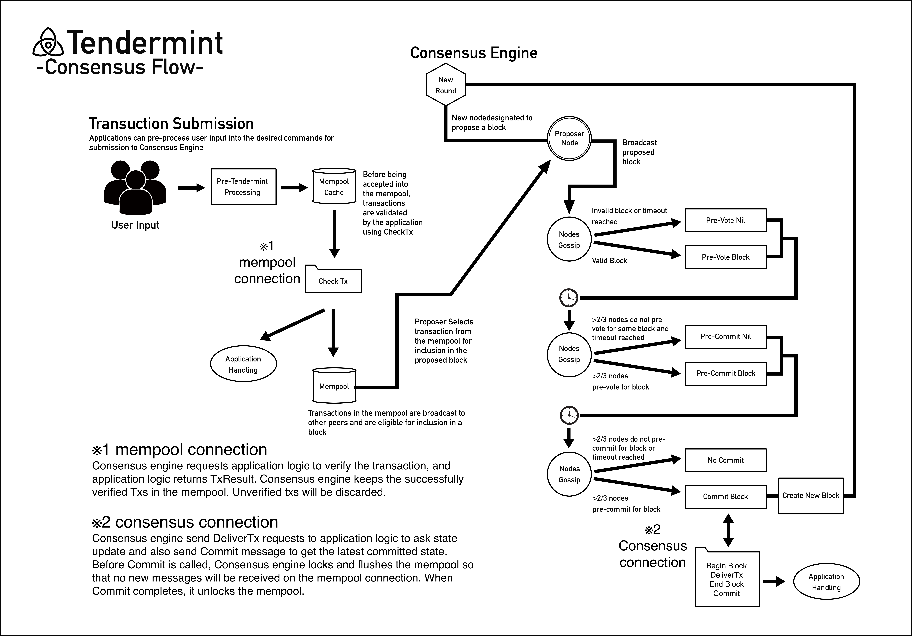

# <a id="top"></a>Nibiru Whitepaper

# <a id="abstract"></a>Abstruct

Nibiru is a fair and secure distributed game platform that supports the development of new games and makes it easier to trade valuable data such as items, weapons and armor in the game. Items, weapons, armors etc in the games will be distributed to the market as uniquely defined tokens on the Nibiru chain, enabling transactions that do not require third parties. Unlike the conventional centralized game structure, Nibiru creates new value for data in a game virtual space because token ownership does not belong to the game operator. The new value created in virtual space has the potential to start to have more realistic value in the future, and to create a larger economy. In order to maintain fairness, Nibiru Network allows transactions to be verified by the users, where flow of funds are visible to avoid counterfeit currency, double spending and other fraudulent acts. Previous monetary systems were based on a clientserver network structure, and their centralized payment systems were vulnerable to hacking and other external attacks, resulting in a substantially high fee to implement such a complex process and adherence to regulation policies. In a decentralized monetary system with a P2P network structure, information will neither be kept in one place, nor would it depend on third parties, offering much higher security and lower burden to the system itself.

# <a id="introduction"></a>Introduction
## <a id="vision"></a>Our Vision

Nibiru allows users to freely manage or trade their in-game items, weapons, armor and other valuable data as digital assets on the blockchain. We are developing with the aim of constructing a blockchain network specialized for the gaming platform.

We are convinced that the construction of a new distributed system specialized for games can solve the "constraint of users' economic behavior in the game space" which the traditional centralized game industry has. Specifically, Nibiru is a non-centralized, yet scalable blockchain network that can achieve quick finality with high throughput that enables immediate settlement to improve UX for blockschain-based games. We believe it is necessary to develop a blockchain for a game, and we aim to achieve that.

Also, in order to maintain the Nibiru chain, we would like to establish a semi-permanently sustainable ecosystem by establishing an appropriate compensation system for the validator.


## <a id="principles"></a>Nibiru Principles
### <a id="sbp"></a> System Benefiting the Players

Traditionally, ownership of items earned through billing and play in clientserver type games belonged to the operating company of games, and not the players themselves. Therefore, players were unable to willingly buy or sell the in-game items, with the items becoming worthless in value when players left to play to another game. That is, in order to maintain the value between different games, it is necessary to have a mechanism in which the player holds the ownership of the item acquired in the game. The Nibiru game platform allows players to hold item tokens in a space separate from the gaming company by holding in-game item tokens as electromagnetic information on the Nibiru blockchain. In addition, the player can exchange each item token with the REPT, which is the distribution currency on the Nibiru platform through DEX, so that the player possesses REPT when transitioning from Game A to Game B on the Nibiru platform. Then the player can use the REPT for purchasing items within
Game B. In this way, by utilizing the Nibiru platform system, in essence, the traditionally prohibited (by game companies) act of RMT becomes possible. In an ever-evolving gaming universe, by managing digital assets ingame, players can enjoy more freedom and a more appealing next-generation type decentralized virtual universe.

### <a id="sgdd"></a> Simplified Game Development for Developers
Many game developers face the dilemma of having the necessary design and technology, but insufficient funds to continue developing games. Furthermore, the conventional centralized platforms used by major companies employ a business model that charges up to 30% to 50% in fees from the developer. Nibiru provides small and medium game companies and developers who belong to a major game maker with a conventional structure, a mechanism that can perform ICO, IEO, STO, etc. as a Funding method to develop an original game. In addition, we will prepare an SDK to support traditional game developers for all functions including item token generation in the game.

### <a id="pngg"></a> Proposal for Next-Generation Gaming
In the current game industry, players have no ownership for any in-game digital assets, and small to medium game companies and their developers act only as subcontractors for the major companies. It means that the business model is structured in a way that concentrates the revenue stream to only the major game companies and existing centralized game platforms. In addition, although with the advent of an ever-increasing number of players active in esports (pro-gamers), the general public regards being immersed in gaming to be unproductive and a means for escapism. One reasoning behind such a perception could be that the ownership of time and money spent and gained in games do not remain to the player as a digital asset. If time spent inside a virtual environment could influence the real world, there will be an enormous change in the way the public views gaming. Virtual space itself is expected to become increasingly more real. At this point, let us compare the state of both current and next-generation games. Next-generation games will offer players the official right to claim item ownership, making them more independent, and with the popularization of E-sports, Pro-gamers will be more familiar to general public. At the same time, for the developers working in the small and medium game companies,it will make it possible for them to raise funds, organize a project team and to develop creative games with only the skills they have without relying on the bland image of major enterprises . Due to advances in science and technology, entertainment gains more importance in such a diversified future. In such a world, gaming will no longer be perceived negatively, rather, it will come to be regarded as not just entertainment, but as a form of profession. A decentralized game platform could be the new solution to the problems faced by the traditional gaming industry. A next-generation decentralized virtual reality will enable game enthusiasts to truly be immersed, in addition to providing game developers much more freedom into creating new games that will meet the needs of the players. Nibiru will provide such a future of gaming to the world.

# <a id="background"></a>Background
## <a id="egi"></a> Evolution of the Current Gaming Industry
In recent years, the market size of PC games such as Massively Multiplayer Online (MMO), such as Multiplayer Online Battle Arena (MOBA), First Person Shooter (FPS), and Role-Playing Game (RPG), continues to increase substantially. In addition, the mobile game market and the VR game market have been rapidly growing along with the spread of smartphones and the innovation of new technologies.

The global gaming market, which was $ 93.1 billion in 2015, topped $ 106.5 billion in 2016, topped $ 121.7 billion in 2017, and grew to $ 137.9 billion in 2018. It is also projected to top $ 151.9 billion by 2019, $ 165.9 billion by 2020, and $ 180.1 billion by 2021. The development of the Internet has facilitated online communication and created diverse communities on the game space. The realistic game space is realized by AR and VR technology, and the game is getting closer to the real world.

## <a id="ifcgi"></a> Issues Facing the Current Gaming Industry
Under conventional game structures, ownership of in-game items remained at the side of operators, and players were unable to hold these items as their assets within the game. The electronic information of an item obtained in-game could only function within its one game, and therefore were unable to pass on its value from its game to other games. The time and funding poured into a game would only hold value within the single gaming space. In addition, trading of items in-game are prohibited by the terms and conditions set forth among the majority of the game-operating companies, making it difficult for players to pass the value of any electronic information beyond that of a single gaming space. Therefore, resulting in limiting the economic activity of the player within the game world. Tradings of In-game items or electronic information are known as RMT (Real Money Trading), but the centralized structure taken by many existing games prohibited RMTs within the terms and conditions of said games. However, it has been analyzed that there is huge demand for such a concept, and the potential for such a market is estimated to be in an upwards of over several tens of billion Dollars. The conventional framework regarding game releases have been that of a paying a hefty publishing fee to a centralized third-party company. To further promote the development and creation of an appealing next-generation virtual reality, there needs to be a gaming environment which makes possible to transfer and settle transactions of electronic value. Nibiru can convert in-game data into tokens, making possible for decentralized transactions within a virtual reality, structured as a distributed-type second-world. No player will be restricted by the limitations and other specific issues set forth by a centralized authority, making it possible to hold in-game items as digital assets, and the freedom to buy, sell and reap the benefits. Recently, there has been a push for the establishment of an RMT Exchange, but Nibiru proposes to disregard a conventional centralized structure, and instead build a system enabling RMT over a decentralized network by using blockchain technology, of which will be detailed in the following chapter. Thus, as a ”Game Platform of the Player, by the Player, and for the Player”, will create a decentralized virtual reality for the next-generation, enabling various economic activities for all game enthusiasts.

## <a id="egt"></a> Blockchain Industry Trends
In 2008, with the release of Satoshi Nakamoto’s ”Bitcoin: A Peer-to-Peer Electronic Cash System” [<a href="#ref-1">1</a>] whitepaper, and subsequent development of Bitcoin, the Bitcoin was hailed as a revolutionary innovation in currency and cash. Furthermore, Bitcoin was the first example of a digital currency without gold convertibility and the backing of a centralized monetary authority. The blockchain technology utilized in the basic management for the Bitcoin was made possible by adopting a simplified algorithm and computing power to enable ledger management by a decentralized network. The Open-source Ethereum [<a href="#ref-2">2</a>] project supervised by the Ethereum Foundation is a next-generation smart contract and decentralized application platform. The majority of cryptocurrencies represented by Ethereum and Bitcoin all utilize blockchain technology at their core. Encryption (of electromagnetic information), Timestamp, consensus algorithm and economic incentive structures, made it possible for decentralized ledger management by P2P transaction process per nodes without trust, resolving issues in a centralized authority, such as high cost, inefficiencies and safety issues of electronic information storage. Although blockchain itself is technically not considered a new technology, the combination of P2P communication, encryption technology and data structures on the chain, can be considered as an innovation.
# <a id="problems"></a>Problems

##<a id="ifbi"></a> Issues Facing the Blockchain Industry
The development of a decentralized goverance system has attracted a large following to the blockchain project, and continues to increase worldwide, with many applications being developed. From digital currencies to applications containing Ethereum-based smart contracts and building Ripple-based global transaction system layers, a variety of use case scenarios are born every day, posing not just further demand, but issues to the blockchain. Unlike most software, a decentralized blockchain structure does not request users to update client and protocol, resulting in severely limiting the system due to the occurrence of ”hard fork” or ”soft fork”, of which leads to heavy losses to the community in conjunction during protocol updates. There are still debates regarding block scalability, hindering the development of Bitcoin protocol. Due to the Bitcoin blockchain being limited in size capacity and therefore considered a factor in clogging over a million transactions, users are faced with an expensive amount of fees to accelerate such transactions. Ethereum faced a similar problem, in that by using hard fork as a remedy to The DAO problem, splintered the community, causing degradation to the user experience. In a climate with numerous hype projects that require no blockchain technology, just to cater to the ongoing speculation fervor of cryptocurrencies, a use case scenario to combat the above challenges and realize a decentralized-society will be essential.

## <a id="pcca"></a> Problems Facing the Current Consensus Algorithm
The consensus algorithms widely used today, like PoW and PoS, cannot be said to have the sufficient algorithms in achieving our vision mentioned in the introduction that building scalable, non-centralized, game-specific blockchains with fast finarity and high throughput, and solve the "constraint of users' economic behavior in the game space".

PoW consensus algorithms are zero-sum games, and executes authorization processes based on the computational power of miners. Specifically, it provides authorization to the initial node that finishes computing the enormous load required in the hash computation. Due to current increases in transaction loads, Difficulty requires super computers and large servers, leading to the consumption of a heavy amount of power, and vulnerability to 51% attacks. In PoW, in particular, it is necessary to carry out approval work by an unspecified number of people, so there is a problem that approval work inevitably takes time, and it can be said that it is not suitable for games requiring immediate settlement. 

PoS is a system providing authorization rights dependent on coin age and volume amount in ownership, and do not have problems such as massive power consumption faced by PoW. However, there is the possibility that due to investors with plenty of capital having a preferential initiative to generate blocks, thus leading to an oligopoly and lower the circulation of the currency. In addition, since in a PoS, it is generating blocks are relatively easy, and it faces the “ Nothing at Stake ” problem of being able to generate blocks without risk. Since there are an unspecified number of nodes from the viewpoint of quick transaction in the game, there is a problem that the throughput capability is not sufficient, and the finality can not be obtained immediately.

## <a id="ietps"></a> Issues to The Ethereum and the Need for TPS

Ethereum made it possible to realize next-generation smart contract by filling the blockchain used in the Bitcoin with a Turing-completed expanded terms. In reality, there are numerous decentralized applications being developed that are based on the Ethereum. Unlike Bitcoin that uses UTXO (Unspent Transaction Output) to present its currency, Ethereum stores data in the state transition inside the blockchain and its ”State” is represented as an object referred as the ”Account” [<a href="#appendix-a"> Appendix A </a>]. An ”Account” will be classified as a Contract Account, managed by its own contract code and a secret key managed by the EOA (Externally Owned Accounts). Two types of account data will be preserved on the blockchain using a state transition function, and implementation of a smart contract executed when certain conditions are met. The Ethereum is an innovative platform as the ultimate-abstract base layer, built with a protocol able to implement various decentralized applications. However, there are issues becoming prevalent as more users enter the Ethereum network. Because the Ethereum network is a platform that makes it possible for all decentralized applications to be implemented, various projects (besides games) are concurrently developed over the Ethereum. Therefore, there is a need for the Ethereum network to process an enormous amount of transactions, with 2018 being increasing up to a maximum of 30,000 cases of unidentified transactions, of which transaction fee will be so expensive. When looking at TPS (Transaction per Second), although it improves upon when compared to Bitcoin, Ethereum number of about 7 to 8 times is clearly insufficient to handle the anticipated increases in the network. In addition, in a gaming industry where immediate means of payment are required, this will lead to a significant decrease in quality to the user experience. Suggestions for improvement based on off chain technology have been discussed, however, the timing of implementation and feasibility are still unclear. In addition, it should be noted that systems rolled back when dealing with the problems to the DAO, and that certain parts of the community broke down due to hard fork. Using Ethereum contains the several issues and risks as various projects becoming intertwined, and in order to realize a free virtual world aimed by Nibiru, an innovative framework that specializes in a high-quality user experience will be important.

## <a id="psc"></a>Problems Facing the Smart Contract

Speaking of the blockchain game on Ethereum, the cat breeding game CryptoKitties, which was implemented on Ethereum in December 2017, is new to memory. It is guaranteed on Ethereum that the owner of the Kitties represented by ERC 721 is the one who holds the token. Thus, the user can also sell the Kitties at the market or send them directly to friends. This "user's ownership of digital assets" is the big difference between traditional games and next-generation games that use blockchains [<a href="#appendix-b"> Appendix B </a>]. While CryptoKitties showed differences from traditional games, it also highlighted potential problems with blockchain games. When CryptoKitties were in vogue, on Ethereum there was a blockage of transactions that caused the gas to rise. Also, at present, the ERC 721 standard provided by openZeppelin has been set, but at that time the specification was not fixed, so the Kitties Contract does not have an index given at the Transfer Event. For this reason, it is necessary to manage tokens in another database because it can not be performed on a blockchain to search for a transaction including a certain address. This contract can not be changed directly, since the kitties contract is already deployed.

As you can see from the above, there are the following problems when trying to implement game items on Ethereum.

-	Subject to compiler language restrictions

Smart contracts are usually developed in a specific programming language that can be interpreted by the underlying virtual machine. These programming languages are often immature and inherently limited by virtual machine constraints. For example, in the Ethereum virtual machine, developers can not implement automatic code execution. Developers are also limited to EVM's account-based systems, and they can only select from a limited set of features for their cryptographic operations. These are just one example, but demonstrate the inflexibility often associated with smart contract environments.

-	Poor performance due to competition with other projects

All Smart Contracts are executed by the same virtual machine. This means that they compete for resources. Also, even if the state machine is split into multiple subsets (for example, by sharding), the smart contract needs to be interoperated by the virtual machine, which results in worse performance than native applications implemented at the state machine level.

-	Low extensibility because it can not be updated

Another problem with the fact that smart contracts share the underlying environment is the resulting restriction of sovereignty. Distributed applications are an ecosystem that involves multiple players. If the application is built on a general purpose virtual machine blockchain, the sovereignty of these players is very limited and will eventually be replaced by management of the underlying blockchain. Even if there is a bug in the blockchain, there is little that can be done about it.

In addition, ERC 721 tokens that represent Kitties are positioned as financial products that are expected to be bought by someone at a higher price in the future rather than as game items. Since this is not inherently a game item that generates value in the game is traded in P2P, it is difficult to bring out the intrinsic fun as a game. An item based on the fun of the game (in other words, an item worth using in an interesting game) is exactly what is valuable in the virtual world.

What's more, although there are many digital assets that make use of such irreplaceability of ERC 721, blockchain games will be best valued by trading on blockchains not only characters but items within the game. In order to do so, a protocol is needed that allows the free exchange of both in-game items represented by Fungible tokens and game characters represented by Non-Fungible tokens.

# <a id="solutions"></a> Solutions
## <a id="nh"></a> Nibiru Hub Specialized in Games
By building a hub that becomes the center of the game using blockchain, it is possible to realize a highly extensible blockchain along each game, and persistent growth can be expected on the Nibiru network, such as the exchange of item tokens for each game.

## <a id="bgsb"></a> The benefits of game specialized blockchain 
Nibiru aims to build a game-specific blockchain using Tendermint [<a href="#ref-3">3</a>]. There are following merits for using an original chain.

- Flexibility

Since tendermint can freely implement an interface conforming to a standard called ABCI, it can independently implement state-machine on blockchain. In addition, the application can freely set the number of validators, set gas, and select a token model.

- performance

Compared to PoW, PoS makes it possible to realize overwhelming TPS. Unlike Ethereum, one of the great benefits is that there is no need to compete for resources with other projects.

-	Security

You do not have to worry about bugs that occur in virtual machines, so you can focus on application development.

- Maintenance

Ethereum does not allow us to fix bugs easily because of the various stakeholders involved, but our own chain based on tendermint allows us to deal with bugs under consensus through governance within the community. In addition, when the specification of the game item is changed, etc., it can be easily upgraded.

## <a id="rept"></a> Token Model
The Nibiru Network is a multi-asset distributed ledger, but there is a special native token called the Nibiru Govenance Token (NGT). NGT is Nibiru Hub's only staking token. NGT indicates that the owner has the right to vote, verify, or delegate to validator. Also, REPT is a token distributed on the Nbiru Hub. This, like Ethereum's ETH, can be used to pay for transaction fees to reduce spam. Block rewards are given as REPTs to validators and delegators that delegate to validators.

### <a id="dis"></a> REPT distribution mechanism
Each time a new Block is generated, the validator and the delegator can obtain PERT as a block reward in accordance with the stake amount of NGT. The upper limit of REPT is 10 billion tokens, and when the initial REPT distribution amount is 5 billion, it is adjusted so that 500 billion REPT will be Block remuneration each year. Therefore, the inflation rate for the next 10 years will be between 10% and 5%. When the limit is reached, there is no validator block reward, and only the transaction fee becomes validator and delegator reward.


###<a id="vm"></a> Validator Management
The Nibiru Hub is built using Tendermint, which relies on a validator that is responsible for committing new blocks. The validator participates in the consensus through performing full nodes and broadcasting votes including cryptographic signatures signed with each private key. Anyone in the network can become a validator candidate, and the candidate can become a validator of Nibiru Hub up tothe candidateupper limit determined within the Network, depending on his NGT (any quantity) and the amount of staked NGT delegated. A validator and a delegator can receive REPT as a reward when generating a block, and can also receive a transaction fee by REPT when executing a Tendermint consensus. Also, validators and delegators on the Nibiru Hub can vote on changes to parameters such as block gas limits, adjustments to upgrades, and revisions to the mechanics of the Nibiru Hub.

The validator plays a special role in the governance system and needs to vote for all proposal. Moreover, the part of the delegator which does not vote will be handed over to validator. If a double signature, repeated offline status, non-participation in operation, and etc, are found, staked NGT (including delegated ones) will be slashed according to its importance. Each validator can set any fee for the delegator.

## <a id="consensus"></a> Consensus Algorithm

### <a id="bft"></a> BFT systems
BFT [<a href="#ref-5">5</a>] solves the uncertainty and performance issues of finality that were the disadvantages of PoW and PoS. In BFT, unlike PoW and PoS, blockchain branching does not occur because the block is generated after decision making by validator. Therefore, since the block decided once is not overturned, finality will be secured, and it is not necessary to continue calculation until finding Nonce like PoW, so the system is also very fast in terms of performance.

Byzantine Fault Tolerance, in regard to consensus systems by N amount of nodes, provides the f = (n-1) / 3 fault-tolerance. This guarantees the functionality and stability of the system by not having a node error consensus exceed past“ (n-1) / 3 ”. Blockchain ’s general ledger are maintained by the validator, and by having the node usually not participating in the consensus, simplifies the process of consensus-building. This tolerance capacity ensures the security and usability, and is suitable for any environment.

### <a id="tendermint"></a> tendermint BFT Algorithm
Nibiru intends to use the BFT-based PoS tendermint as a consensus engine, which solves the problems of the above existing consensus algorithm and has strong fault tolerance and secures finality. Tendermint is software for securely and consistently replicating an application on multiple machines. Being secure means that Tendermint work even if up to 1/3 machines do not function in any way and consistently all unbroken machines will look at the same transaction log and calculate the same state. Secure and consistent replication is a fundamental issue in distributed systems. This plays an important role in the fault tolerance of a wide range of applications, from currency to elections, infrastructure orchestration and beyond. Tendermint consists of two major technical components: a blockchain consensus engine and a general purpose application interface. A consensus engine called Tendermint Core is where the same transactions are recorded in the same order on all machines. An application interface called an application block chain interface (ABCI) allows transactions to be processed in any programming language. Developers can use Tendermint for BFT state machine replication of applications written in any programming language. Tendermint is designed to be easy to use, understandable, high performance, and useful for a variety of distributed applications. By using Tendermint, there are the following advantages.

- Handles thousands of transactions per second
- Finality can be obtained immediately after the block is created (transactions that have been approved once are not reversed. This is a voting-type consensus with BFT characteristics)
- It is possible to develop around a blockchain protocol in any programming language
- Implementable with public and private chains
- Safe unless more than one-third of network participants are malicious

Next we will look at transaction handling and consensus building for applications implemented with tendermint.




- The application side user generates a transaction, and the application client writes data to the daemon.
- The daemon side receives the client request and flows the transaction to Mempool Cache.
- Transaction verification is performed on the application logic side using CheckTx (mempool connection)
- If the verification passes, the transaction is moved to mempool, and the transaction not passing the verification is rejected
- The block proposed by validator (proposer) is consensus among other validators based on tendermint's three-phase commit algorithm
- validator sends BeginBlock, DeliverTx ... EndBlock, Commit to the application logic side using abci-cli (consensus connection)
- On the application logic side, update the transaction state and validator set, and return the information to the tendermint side
- Each validator stores a new block in its own DB.

It is interesting to note that the format of blocks is already fixed in tendermint, and the application needs to create a transaction of a suitable format through implementing ABCI. Then, for any transaction, a block will be generated on the tendermint as defined, and the application side can easily implement in the consensus layer.


## <a id="nf"></a> Nibiru Functions
### <a id="wa"></a> wallet and account
Currently, cryptocurrency transaction by users are typically processed by using specialized wallets. But it involves many complicated processes and when concurrently using existing services over the gaming platform, it significantly decreases the quality of the user experience. However, wallets used over the Nibiru are associated by in-game IDs and transactions between players will be implemented as fast and simple as possible. 

Nibiru wallets can support all tokens issued over the Nibiru platform, and it can also secure and safeguard not just REPT, but item-tokens from various other games as well. In addition, like that of conventional wallet services, aside from sending REPT and item-tokens to the address of a third party with a Nibiru wallet, it can access Nibiru DEX to buy and sell itemtokens between users. 

To play the games on the Nibiru platform, the user first creates a Nibiru wallet. Upon creating the wallet, a Nibiru ID will be assigned per user. By logging into the wallet using the Nibiru ID and the password generated when creating the wallet, users can simultaneously manage the account balance of REPT and item-tokens, in addition to setting up the registered game account. The wallet and the game account are associated by the Nibiru ID, whereupon by logging into the wallet, the user has simultaneously logged into the game account, making possible to switch to playing the game at the one tap. By integrating the game account and wallet features through association by the Nibiru ID, users are free from the conventional hassles of having to separately manage your game account and wallet (separately login to both wallet and game accounts, or login to the wallet account only when transactions of item-tokens  and purchasing items become necessary), which enhances the user experience. Regarding existing games, by having the game companies incorporate SDK to generate item tokens, this will make it possible for items managed over the Nibiru chain to appear in existing games. At such time, conventional users still not registered to the Nibiru wallet can participate in item transactions just by generating a new Nibiru wallet. Furthermore, by including features such as chats, friends and group functions, there will be more active exchange between players, blurring the line between games.

### <a id="it"></a> Item Token
In a next-generation decentralized gaming platform, players hold ownership to their in-game items as digital assets, and are free to actively engage in transactions. In such an environment, the generation of the item token is a feature that most characterizes this platform. In-game items secured in the servers by conventional operators can be managed, traded, bought and sold by the users through the utilization of blockchain technology, which in turn, creates an enormous economy within the virtual space as a second world. There are two types of tokens: Fundible (can be substituted) and NonFundible (cannot be substituted) tokens. The former, of which can be exemplified as a potion common throughout the game, supports the ERC-20 token over the Ethereum. A game item as a Fundible token could each be substituted, an example being 1 token owned by Alice holding the same value as 1 token owned by Bob. However, most games include unique items with variables in value to make such in-game universes more exciting. For such in-game items with unique Levels, attack powers and skill sets, these status parameters will each be stored in-game as meta data and be turned into Non-Fundible tokens. This, corresponding to the ERC-721 token over the Ethereum, becomes an irreplaceable kind of a token. In this case, if 1 token owned by Alice and 1 token owned by Bob were to be exchanged, it could not be considered as having an equivalent value. In either case regarding any item tokens, the user has ownership as a digital asset over the Nibiru, making it possible to simplify the transaction using Nibiru DEX. In addition, Nibiru will facilitate SDK as a system for easily allowing tokens to be issued by the game developers.

### <a id="dex"></a> Nibiru Dex and Auction
Most current cryptocurrency transactions are processed through an Exchange operator. A centralized approach is made by the Exchange admin side, regarding the decision-making process hence such an Exchange is called the Centralized Exchange. Users will send assets via their wallet to the Exchange’s wallet, where the user’s account balance will be managed within the database at the Exchange with the assets itself being stored within the Exchange. Therefore, users are forced to trust the Exchange and their digital assets completely held by a third party (Exchanges). In a centralized Exchange, there are an abundance of cases where the Exchanges themselves make off with user assets or have hacking incidents where customer information is leaked. Due to a single point of failure, there are also risks of access concentration and DDoS attacks. Under the such situations, secure transactions are threatened not because of the blockchain itself, but because of the Exchange server which goes down. 

On the other hand, an Exchange running on smart contracts without a central operator is called Decentralized Exchanges. Users are responsible to manage their own assets and during an exchange, users are able to deposit by sending their tokens to the contract address via their wallet, making transactions possible without trusting a third party. However, compared to a Centralized Exchange, due to low user numbers and lacking in fluidity, it is not practical yet[<a href="#appendix-c"> Appendix C </a>].  

With the above in mind, in order to realize a distributed market of item-tokens without going through a third party, in the Nibiru, a Nibiru DEX will be built to establish an environment where players can freely buy and sell item-tokens. With a Nibiru DEX, various item-tokens can be exchanged over the Nibiru platform using the REPT as the basic currency. Therefore, Alice can sell off the item-tokens from Game A to purchase item-tokens from Game B to use as an item within Game B. The exchange rate between item-tokens and REPT will depend on the market, with market pricing being equated to match the supply and demand. With scarcity becoming the template for how high in value an item will be, as more economic activity by the players becomes prevalent in the virtual space, a virtual economy through the transaction of item-tokens over the Nibiru DEX will be established. Even Nibiru DEX, because of its impracticality without fluidity, an ongoing project to adopt a mechanism to automatically determine the token price and fluidity, thereby making it possible for an immediate payment method called the Bancor protcol[<a href="#ref-4"> 4 </a>], are being discussed to introduce. 

In addition, regarding rare item-tokens of which only a small amount are issued, the selling and buying at DEX will not be sufficient, so instead a system called a Nibiru Auction will be adopted, and auctioned off by bidding within a restricted time. Since based on a predetermined auction format, players seeking to sell itemtokens can sell off to the highest bid by only setting the submission deadline.  

### <a id="et"></a> Escrow transactions between Players
If wishing to directly have a transaction with a third party you have become familiar through the gaming community, dishonest transactions can be avoided by using the escrow transaction established over the Nibiru. Consider the following simple example. Alice and Bob became friends through the chat feature and they both agree to exchange an item she owns from Game A with an item that he owns from Game B. Now although it is possible for Alice to send the item-token to Bob, if Bob held malicious intent, there is the possibility that Alice may send her item to Bob, but Bob may not in turn send his item to Alice. Then, Alice will become victim of fraud. Escrow transactions over the Nibiru make it possible to use originally implemented module. After both sending the itemtoken to their respective escrow address, the item token transfer function defined in the module will be automatically executed, so that Alice will receive the item form Game B, and Bob will receive an item-token from Game A. In addition, in case Bob fails to send an item-token from Game B to the escrow address within the time limit, Alice can prevent wrongdoing by setting the limit time to make a rule to have her item-token from Game A to be returned.

### <a id="funding"></a> Nibiru Funding
Currently, many of the development for MMORPGs and social network games are being done by small to medium scale companies under subcontract from the major game companies. Even applications such as mobile games can now be developed by individuals, so the conventional method of having to be affiliated with a major game company in order to create games have been steadily changing. Over the Nibiru, an fund raising or recruiting a project team will be established freely, aimed at placing a system for anyone, including freelance developers and small to medium scale companies short on funding. Game developers who provide ICO, IEO or STOs can propose whitepapers and game designs to the community that clearly indicates the ideas and merits to the patrons of new games. Users can then decide whether or not to invest in such a project after strict scrutiny and discussion within the community. Investors can transfer REPT to the address provided by the game developer hosting the fund raising, and receive the native tokens. Owners of native tokens will be the recipient of various merits provided by the host of these fund rasing, such as preferential acquisition of rare items at the launch of a game, or receive X% of the game sales in REPT automatically. This fund raising model, from the side of investors will not only support new games, but will allow developers to solicit funding and smooth out the development process. This will create a cycle leading to more and more new games over the Nibiru, and with the advent of an increase in games, lead to an increase of new users and contribute to the further growth of the Nibiru platform. 

Traditionally, when establishing game funding, funding could only receive back a dividend that were of a prescribed percentage after the closing of an account. Gaming companies had incentive to increase expenses to reduce the profit margins to the investors as much as possible. In addition, dividends took several months to actually be returned to the investor, further hindering potential investors into entering the game industry. 

In using the Nibiru Funding, game developers can efficiently raise the funds and build teams to concentrate on developing games. Due to a “trustless” system employing a blockchain, investors too can actively invest in game projects without worrying about any wrongdoing from the developer side. At the same time, a portion of the native token issued in the Nibiru Funding are considered as security tokens, and risks conflicting with international law. For this reason, game developers must be compliant to the laws per region. For example, when hosting an ICO, implement it under cooperation with a traditionally licensed funding organization.

### <a id="sdk"></a> Nibiru SDK
Provide an SDK so that any game developer, conventional or not, can easily participate into the Nibiru community, and create a decentralized gaming platform. For example, many games today are created using software such as the Unity and Unreal Engine. By preparing the SDK which can be applied to these software, developers who have been engaged in game production can easily connect with Nibiru. When installing a payment system on an existing platform, payment of 30 to 70% or more was required as the fee, but there is no fee for payment using the Nibiru SDK.

# <a id="conclusion"></a> Conclusion
Blockchain, as technology to authenticate transactions P2P (Peer to Peer) without the need for a centralized third party have evolved through the emergence of Bitcoin, and with it has attracted attention in various industries as revolutionary in tamper-resistant and highly available technology that allows significant savings to operation costs. Aside from aspects such as money transfers and means for payment, there have been efforts to apply it to international money transfers and IoT, with many empirical studies being done in various fields. In any case however, the practicality of such are still far from being realized, and the reality being that they are all still in the developmental phases. In 2017, various blockchain project were launched, with an enormous surge in finance activities through ICO. However, in certain circles, there were many fraudulent cases of projects that raised enormous funding through ICO by quite literally associating with blockchain terminology, when in fact there were no need to use blockchain. As ”trustless” and ”permissionless” being the core values of blockchain, any projects ignoring such values are in effect no different to conventional systems, and not revolutionary in creating anything next-generation. In fact, it is not so far off to say that the key to the blockchain project are to fundamentally understand key concepts of the blockchain, the community supporting the project, the significance of tokens, and the product itself. Communities are, in essence, open sourced and a bottom-to-top ecosystem with a nonprofit belief, of which are different from existing top-to-bottom business ecosystems. Tokens represents value in ownership, and though merely electronic data, holds an important role as incentive in creating a new economy within the virtual world. Products are technological deliverables itself using blockchain. If there were no value to the existence of communities and tokens, having only a product cannot be appealing enough towards the blockchain project. As there are still very few use case scenarios of blockchain, establishing a use case scenario, will realize the potential of any blockchain projects in the future. 

As Nibiru has aspects of a blockchain project, in the world that various attempts to implement blockchain technologies, in order to establish a presence regarding use case scenarios in gaming, there is a need to build a blockchain based in practicality and associated extension applications. In order to achieve this, Nibiru will establish item ownership to the user, focus on realizing in-game item tokens, and develop Nibiru DEX to foster easy trade between users, and an Nibiru Funding and SDK within the Nibiru for game developers. Aside from a community-based operation, Nibiru will treat NGT and REPT as its main currency and hold value to tokens, creating a decentralized gaming platform that will change conventional games in order to realize a token economy within the virtual world.  

On the other hand, Nibiru will act as ambassadors to the general public, in order to change the perception of games and how it has changed. If at any time a player feels ”bored” with a game, it may be that they cannot see purpose of  the game and what lies ahead. Perhaps they are under the preconceived notion that games are a form of entertainment, and that it has no relevance to the real world. However, with the evolution of e-sports, conventional concepts regarding games are starting change around the world. In addition, by using blockchain technology, though still in developmental phase, will make it possible to store digital data in a decentralized way, all the while being tamper-proof and highly available. The days of game playing amounting to nothing in the real world is rapidly closing. We are now at the forefront of the game industry where game play will lead to impressive, accolades and accomplishment in the real world. Reflecting on such a time, Nibiru as a decentralized gaming platform, will understand the point of view by the player and provide new value to games. There may be diversity in the feel, the accolades and the accomplishments felt per player, but Nibiru will aim to re-clarify such vague notions and promise to build a ”Completely Free and Realistic” virtual reality. We believe our young generation to be the creators of the new era.

Nibiru: For all the games enthusiasts


# <a id="references"></a> References
<div id="ref-1">[1] Satoshi Nakamoto. “Bitcoin: A Peer-to-peer Electronic Cash System.”
<a href="https://bitcoin.org/bitcoin.pdf">https://bitcoin.org/bitcoin.pdf</a>
, April 2018.</div>

<div id="ref-2">
[2] Ethereum.
<a href="https://ethereum.org">https://ethereum.org</a>
</div>

<div id="ref-3">[3] Ethan Buchman. "Tendermint: Byzantine Fault Tolerance in the Age of Blockchains"
<a href="https://allquantor.at/blockchainbib/pdf/buchman2016tendermint.pdf">https://allquantor.at/blockchainbib/pdf/buchman2016tendermint.pdf</a>
, June 2016.</div>

<div id="ref-4">
[4] Castro M, Liskov B. “Practical Byzantine fault tolerance”
<a href="http://pmg.csail.mit.edu/papers/osdi99.pdf">http://pmg.csail.mit.edu/papers/osdi99.pdf</a>
 ,february 1999.</div>

<div id="ref-5">
[5] Eyal Hertzog.“Bancor Protocol Continuous Liquidity for Cryptographic Tokens through their
Smart Contracts”
<a href="https://storage.googleapis.com/website-bancor/2018/04/01ba8253-bancor_protocol_whitepaper_en.pdf">https://storage.googleapis.com/website-bancor/2018/04/01ba8253-bancor_protocol_whitepaper_en.pdf</a>
, March 2018.
</div>

<!-- [4] DR. GAVIN WOOD. “ETHEREUM: A SECURE DECENTRALISED GENERALISED -->
<!-- TRANSACTION LEDGER BYZANTIUM VERSION” -->
<!-- https://ethereum.github.io/yellowpaper/paper.pdf, April 2018. -->

<!-- [6] SECURITIES AND EXCHANGE COMISSION, July 25, 2017 ”Report of Investigation Pursuant to Section 21(a) of the Securities Exchange Act of 1934: The DAO” -->
<!-- https://www.sec.gov/litigation/investreport/34-81207.pdf -->

<div id="ref-6">
[6] Hyper Ledger <a href="https://hub.digitalasset.com/blog/retiring-hyperledger-beta-re-open-sourcing-soon-and-other-changes">https://hub.digitalasset.com/blog/retiring-hyperledger-beta-re-open-sourcing-soon-and-other-changes</a></div>

<!-- Ethan Buchman, Jae Kwon, Zarko Milosevic. "The latest gossip on BFT consensus" -->
<!-- https://arxiv.org/pdf/1807.04938.pdf, September 2018. -->

<!-- [8] Yang Xiao, Ning Zhang, Weijing Lou, Y.Thomas Hou. "A Survey of Distributed Consensus Protocols for Blockchain Networks" -->
<!-- https://arxiv.org/pdf/1904.04098.pdf, April 2019. -->


# <a id="appendices"></a> Appendices

## <a id="appendix-a"></a> Appendix A: Account State vs UTXOs

Many cryptocurrencies including bitcoin and that are derived from this, are managed based on the UTXOs (an Unspent Transaction outputs) model. By collecting UTXOs from past transaction histories, and then creating other new UTXOs, such UTXOs will be used in future transactions as continuous forms of currency. At this time, each UTXO can be considered similar in concepts to existing coins. As this method is supported by numerous projects after bitcoin, the following has been stated as reasoning for Hyperledger to adopt UTXOs[<a href="#ref-6">6</a>].

>“We are also switching from our simplistic notion of accounts and balances to adopt to de facto standard of the Bitcoin UTXO model, lightly modified. While Hyperledger does not use Bitcoin in any way, the Bitcoin system is still extremely large and innovative, with hundreds of millions of dollars invested. By adopting the Bitcoin transaction model as standard, users of Hyperledger will benefit from innovation in Bitcoin and vice versa, as well as making Hyperledger more interoperable.”

Regarding the consensus system of the blockchain network, it is crucial that all nodes participating will process transactions in equal order to reach a comparable conclusion. Therefore, in order to gain consensus from the participants, execution of a parallel process and scale expansion will be required, at which time the basic structure of transaction taking place will be crucial. In contrast to the UTXOs model adopted by bitcoin, Ethereum adopts the account state transition model, and understanding the advantages and disadvantages of these models will be necessity. Unlike the UTXOs model, Account model is closer in concept to managing a bank account, and presents its currency by simply saving the state transition of the currency balance per user account. There are disadvantages however, such as his system leaks the account balance information. Further discussion regarding UTXOs and Account models can be summarized in the below.

### A.1 UTXO Model Benefits

- Concurrent processing

Though dependent on how owners manage their coin, users can make it difficult to associate the account to the address by using a new wallet per UTXOs. This is a suitable characteristic of currency. In an Account model, privacy management using this method will be difficult, so a system such as a zero-knowledge proof will be required.

- High Level of Privacy

Though dependent on how a owner manages the coins, users can make it difficult to associate the account to the address by using a new account per UTXOs. This is a suitable characteristic of currency. In an Account model, privacy management using this method will be difficult, so a system such as a zero-knowledge proof will be required. 

- Potential scalability

UTXOs models have characteristics suitable solving scalability problems regarding certain perspectives. For example, in a UTXOs model, if a part of the data from the Merkle tree is lost, only the owner of the currency suffers damage. In an Account model, in addition to the owner, all other accounts who had association by such as messaging through their accounts, will suffer losses as well.

- Re-entrant tolerance

Due to UTXO being simply managed by boolean, it does not face the problem of deterioration due to unexpected reentrancy. This is a big problem raised during The DAO attacks at the initial stages of Ethereum.

### A.2 Benefits of the Account Model

- Simplicity

In a UTXOs model, when managing multiple UTXOs using the wallet, it requires to think of appropriating all UTXOs. But in an Account model, it only requires to simply read the balance from the database.

- Fungibility
As each set of coins does not preserve the block chain at the code level, substitution possibilities of each coin remain intact, and does not store specific information.

- Ease of reference by light clients
Although the light client on the other hand can gain all information pertaining to a single account by following the state tree in an Account Model, from the perspective of the UTXO, each transaction differs per reference point, making it a complicated system. In addition, integrating services such as wallets becomes relatively easy. When executing a smart contract for the above data structure, the workload will be heavy.

## <a id="appendix-b"></a> Appendix B: how to define game assets on Ethereum 

Game item represented by ERC 721 token
Beginning with Cryptokitties , the current Ethereum Dapps game centers on tokens in line with the ERC 721 standard. The ERC 721 token standard defines non-fungible token metadata and uses it as a game item or character.

For example, in Cryptokitties , we define a Kitty structure (struct) linked to the ID of the ERC 721 token, and store the necessary parameters for the character there.

```sol
struct Kitty {
    uint256 gene;
    uint64 birthTime;
    uint64 cooldownEndBlock;
    uint32 matronId;
    uint32 sireId;
    uint32 siringWithId;
    uint16 cooldownIndex;
    uint16 generation;
}
```

In Cryptokitteis , parameters contained in this structure manage metadata of characters represented by ERC 721 tokens. Various Dapps Game is present, the token that conforms to ERC721, are distinguished item by the metadata and id that is swung into one single token. “Abstraction of game items” by such metadata is a very important element in Dapps development. In the example of CryptoKitties , metadata includes information on mating, parents, and generations, in addition to genes that are factors that determine appearance. By including such information in the metadata, it corresponds to the auction function and the mating function, but it may be difficult to add more functions in the future.Thus, in Dapp , it can be said that the data structure defined at the beginning greatly affects the development of the game after that. The meta data structure defined at the beginning changes the extensibility of the game after that. In Dapps games conforming to the ERC 721 token , game items are expressed as non-fungible tokens so that they can be distinguished one by one. Certainly, for items in which each item has its own attribute or the parameter changes as the user develops it, it can be said that the expression with Non-Fungible Token is appropriate.

However, items such as accessories the parameter does not change for each item: are you about the (for example, such as “herb”, “sword”, “pebble”), it is better to be expressed as a Fungible token. Providing separate metadata for inherently Fungible tokens reduces the liquidity of the game items, which can be said to be the core of block chain game innovation as well as waste in block chain games that want to save data resources It is also a cause. Let's consider an example. It is assumed that there is an “ordinary sword” which does not have to be distinguished one by one and a “rare sword” whose parameters are different one by one in a game. It is appropriate to express the former as Fungible and the latter as Non-Fungible tokens. However, when all items have been classified as Non-Fungible items, when you want to exchange “10 ordinary swords” and “1 rare sword”, “10 ordinary swords” one by one It needs to be replaced as a separate sword. Therefore, extra transaction costs are incurred at the time of replacement. This is a big loss in the block chain game where transaction fee is one of the big problems. In this respect, We believe that there is a need for a new token standard that can represent both Non-Fungible tokens and Fungible tokens, which will be converted to the ERC 721 standard, and we would like to describe the ERC 1155 Token that implements it.

### B.1 External appearance of ERC1155 standard
Standard interface for smart contracts that manage multiple token types. A single ERC 1155 contract can include any combination of Fungible tokens, Non-Fungible tokens, or other configurations (eg, semi-substitute tokens). This standard is a smart contract interface that can represent any number of Fungible and Non-Fungible token types. Existing standards, such as ERC-20, require you to deploy separate contracts for each token type. The token ID in the ERC-721 standard is a single non-substitutional index, and these non-substitutional groups are deployed as a single contract that contains the settings for the entire collection. In contrast, the ERC-1155 multi-token standard allows each token ID to represent a new configurable token type . This token type has its own metadata, supplies, and other attributes. The id parameter is included in each function’s parameter and indicates the token or token type in the transaction. Token standards such as ERC-20 and ERC-721 require that you deploy a separate contract for each type of token. These places a lot of redundant bytecodes in the Ethereum blockchain and separates each token contract into its own authorized address, which limits certain functions. With the advent of blockchain games and platforms that support them, game developers may have created thousands of token types, and new types of token standards are needed to support them . However, ERC-1155 is not game specific, so many other applications can benefit from this flexibility. This design allows for new features such as transferring multiple token types at one time, saving on transaction costs. Multiple token transactions (escrow / atomic swap) can be built on this standard, which removes the need to “approve” individual token contracts separately. It is also easy to describe and mix multiple substitutable or non-substitutable token types in a single contract.

### B.2 ERC1155 token metadata design
As mentioned at the beginning, it is very important how to define the structure of metadata when defining game items. While the ERC 1155 token allows for free generation of tokens later, metadata cannot be freely set later. Therefore, when using ERC 1155 tokens as game items, it is necessary to set metadata carefully in the beginning. If you intend to create a highly extensible game, for example, given the non-fungible token example, you will need to have both the item you want to battle (the character) and the item that has nothing to do with the battle. (Example: Monsters and Equipment Items). Also, some items (characters) will grow with the progress of the game, and some characters will remain unchanged from their initial values. In addition, for Fungible tokens, there are “harvest” which is a recovery item, and there are also items such as “sword” and “gun” which strengthens skills. How do you set up abstracted metadata that can express such differences? This is a very difficult point when using ERC 1155 tokens as game items. As metadata of non-fungible ERC1155 tokens, referring to ERC 721 case, define metadata such as gene and skill, and in the case of tokens with growth and change, change these values appropriately. It may be possible to express the growth of the character. On the other hand, in Fungible tokens, in addition to parameters such as totalSupply and name that are also included in the existing ERC 20 tokens, it may be possible to use other string, uint or array type parameters to express information about the characteristics of the item such as skills and effects. In any case, by setting appropriate metadata, you will be able to create a game that is more scalable and fluid than existing Dapps games.

### B.3 ERC1155 metadata configuration sample
Below are examples of game items using the ERC1155. For example, consider the following as an example of Non-Fungible token.

```sol
struct NonFungibleMetaData {
        uint256 id;
        uint256 genes;
        uint8[] skills;
        string name;
        uint256 winCount;
        uint256 papaId;
        uint256 momId;
        uint256 saleDuration;
        bool isOnSale;
}
```
In this example , metadata was set up to support functions such as name, ability, appearance, mating, and auction of Non-Fungible tokens. If this is an image of an existing Dapp character, the above-mentioned functions may not be necessary and enough.

On the other hand, consider the following as a Fungible token.

```sol
struct FungibleItems {
        string name;
        uint256 totalSupply;
        uint256 itemPrice;
        FungibleItemExecInterface tokenContract;
        mapping(address => uint256) balances;
   }

```
Here, we have prepared Fungible token name, total supply amount, price, holding amount, and item execution interface. By setting FungibleItemExecInterfacewell, you can abstract Fungible items such as herbs and weapons and even execute items.

Below is an example of FungibleItemExecInterface.

```sol
contract FungibleItemExecInterface {
    function modifyGenes(uint256 _gene) external returns(uint256);
    function modifySkills(uint8[] _skills) external returns(uint8[]);
}
```

Here, two functions are defined. modifyGenes is a function that receives nonFungibleItem's gene and returns the modified gene. On the other hand, modifySkills is a function that receives non-Fungible Item skills and returns the modified skills. By defining the interface in this way, it is possible to change the effect given to the character for each item. If you want to implement a unique function for each game such as battle or gacha, there is a problem to consider further including cooperation with off-chain, but by setting the above metadata, it is possible to multiple items It is thought that it can respond flexibly.

## <a id="appendix-c"></a> Appendix C: DEX vs CEX
Centralized exchanges are platforms or applications that allow traders to trade cryptographic currencies using legal currencies or other cryptographic currencies. On such an ordinary exchange, we allocate the address for each user and manage the assets as before. The user wishing to trade will first transfer the cryptographic currency to that address (omitted if purchased in legal currency).Therefore, it is the exchange that manages the encryption currency and its secret key sent to the exchange. In addition, trading orders issued by users are matched in unique databases within exchanges. Of course, they are not recorded in the block chain. When an order is placed, the exchange is structured to check buy orders and sell orders in real time. The important thing here is that the user does not have the secret key of the crypto currency when doing such a token exchange. In other words, just like banks, users will have to trust the exchange to store and manage their own balances.

There is, of course, some guarantee of storing user’s cryptographic assets in a centralized way, but there are basic risks associated with doing so. Also, while a centralized exchange is legally responsible for user funds, it is often susceptible to hacking.

There is a word trustless as one of the idea of public blockchain, but between the centralized exchange and the user, it is impossible to realize the essential trustless state.

On the other hand, in DEX, the user himself manages the secret key. Although this mechanism seems to be commonplace at first glance, as described above, it differs greatly from the case of a centralized exchange. Also, since it is executed on a Smart Contract when exchanging an asset, it can be said that it is a trustless mechanism (However, considering UX, it is necessary to perform order matching etc. on an off chain, so to some extent DEX service side I have to trust that).

Also, as seen in the 0x protocol, it is also an attraction that anyone can build a DEX network by using the same protocol. Indeed, DEX using the 0x protocol includes Paradex, Radar Relay, etc.

In summary it turns out that there are the following characteristics.

- The user manages the private key by him / herself.
- Management from centralized management on smart contract
- Anyone can build a network

### C.1 Necessity of DEX

- Privacy

One of the main benefits of a decentralized exchange is its emphasis on privacy and anonymity. A distributed exchange does not require anything but a username, password, and cryptographic wallet to initiate a transaction.

Being able to sign up and start trading without going through KYC is attractive for those who wish to be anonymous, and those who can quickly deposit, trade and withdraw their money.

However, there are also places that take KYC in DEX in the wake of the EtherDelta being fined by the SEC in November 2018.
Reference: https://www.sec.gov/news/press-release/2018-258

- Security

Some types of decentralized exchanges tend to be more secure than centralized exchanges, as they do not have a centralized hot wallet for hackers to target and steal all users' funds.

As DEX performs a distributed payment for each order, this can minimize the potential attack path that hackers exploit, and in some cases there is little chance that the attack will succeed I can say that.

Users are able to maintain full custody of their funds (held by the contract) placed in escrow while they are trading, and the DEX side gives them peace of mind in the security of their funds. Can provide a feeling. Users can recover their funds after the escrow transaction has expired, even if DEX ceases to function.

- The low possibility of operation

It has censored tolerance to the centralized entity, government, or authorities. This minimizes the possibility of manipulation by a third party, without the orderbook itself maintaining and executing the transaction. In the past, some exchanges have made wash transactions to create fake volumes, reduce token deposits and withdrawals during critical transactions, or manipulate trading orders and token prices There is a centralized exchange that has been criticized.

Reference: https://medium.com/@sylvainartplayribes/chasing-fake-volume-a-crypto-plague-ea1a3c1e0b5e

As there is no controlled orderbook for a decentralized exchange, this means that such operational behavior is unlikely to occur.

### C.2 Problems with DEX
- Speed
Distributed exchanges are operated on-chain using Smart Contract, so it may take longer to implement an agreement and enforce trading orders than a centralized off-chain trading platform. When traffic is heavy, when congestion occurs in the block chain network, escrow, cash out, or execution of transactions becomes impossible in a timely manner, so that DEX can not be used effectively.

- UX
In the case of on-chain support such as deposit and withdraw timing, it is necessary to wait until the transaction node is stored in the block and the network node confirms it. Therefore, it is often time consuming compared to a centralized exchange. Also, although most of the online services on the web have customer service, in the case of DEX, it becomes difficult to respond appropriately to each user when problems occur. (The user’s information is held on the DEX side Because it is not). Therefore, it can be said that there is a problem from the viewpoint of usability that it is difficult to master it to some extent if it is not person who is familiar with encryption currency or block chain.

- Only exchange of cryptographic currencies
Although it can not be helped because of the nature of DEX, it is impossible to exchange a statutory currency and a cryptographic currency which are not managed by a block chain with a smart contract. However, the development of protocols for exchanging tokens on different block chains is ongoing.

reference:

WBTC: https://www.wbtc.network/

HTLCs: https://en.bitcoin.it/wiki/Hash_Time_Locked_Contracts

There are currently various Dapps, but what is important is that you can freely exchange assets within each other's Dapps. Of course, none of the current Ð apps are UX superior, so there are still more challenges than existing applications, but as scalability issues improve in the future, UX will improve and the number of users will increase Expected. At thCurrently there are various Dapps, but what is important is that you can freely exchange assets within each other ‘s Dapps . Of course, all of the current Dapps are not superior in terms of UX, so there are still many problems compared to existing applications, but as we improve the scalability problem in the future, UX improves and the number of users increases Expected. At that time, if exchange of token between Dapps and exchange of assets between Dapps can be done smoothly, it will be recognized as a new use case of the block chain.at time, if the exchange of tokens between Dapps and the exchange of assets between Dapps can be performed smoothly, it will be recognized as a new use case of the blockchain.

# <a id="risks"></a> Risks
The information contained herein is only to stimulate discussion amongst the community, and not intended to induce any sales of Nibiru or the related company’s share or securities. Any such solicitation will be made in accordance to the relevant legal terms. The information and analysis provided in this document shall not be used as basis for judgement on investment and shall not include specific recommendations. Therefore, this document does not offer views or suggestions related to or leading to investment. The purpose of this document is not to market or induce securities. Nibiru will not be responsible for any loss or damage of any kind, whether directly or indirectly caused by errors, omissions or inaccuracies recorded in this document. In addition, the information recorded in this document shall be subject to change without notice. Please note the possibility of modifications to this document (edition 1.0) in the future, and any such modifications shall be specified. Please refer to the Nibiru webpage (https://nibiru.network) for the updated version of the document.


1. NGT Access Risk Due to Loss of Credential Information:  
The buyer’s NGT is associated with the Ethereum wallet address before it is allocated. The address of the Ethereum wallet is the information that managed by the buyer himself. If the information is lost, the loss of the authority to login may cause loss of NGTs. The buyer must keep the information of private key safely in more than one, or in physically work-independent place with backup.

2. Risk Associated with Buyer Eligibility:   
Users with their account information or any third party with access to secret keys can perform NGT-related operations. To mitigate this risk, users should use electronic devices to prevent unauthorized access.

3. Risk Associated with Regulatory Measures and Legal:  
Amendment Block chain technology is the subject reviewed by regulators around the world. Nibiru and NGT may also be affected by any investigation, regulatory measures or amendments to the law, which may hinder or restrict Nibiru.

4. Risk Associated with Lack of Attention to Games or Distributed:  
Applications It is possible that the attention to Nibiru and NGT is only limited to people who care about the production and development of decentralized applications and those who are interested in games, but not used in most businesses, individuals and other organizations that are unrelated to games. The lack of attention by people other than the limited population above may have an impact on the development of Nibiru and the potential value of NGT.

5. Risk Associated with Buyer ’s Dissatisfaction with Nibiru upon:  
Completion Nibiru is still in the planning stage, and substantial changes to the contents will still be possible before launch. Due to changes to planning and implementation at the designing period, or other reasons including the running of Nibiru, it is possible that the forms or features of the NGT or Nibiru that buyers purchased fall short of their expectations.

6. Risk Associated with Theft and Hacker Attacks:  
Hackers and other groups or organizations may damage the usability of Nibiru or NGT by various means such as Denial of Service, Sybil attack, Spoofing, Smurf, malware and protocol-based attacks.

7. Risk Associated with Weakness and Vulnerabilities in Encryption:  
With advances in the encryption technology and quantum computer, more risks may emerge in the field of encryption and Nibiru, resulting in NGTs being stolen or lost.

8. Risk Associated with Insufficient Use or Utilization of Nibiru:  
While NGT should not be seen as an investment, it has the potential to have values over time. If Nibiru is not fully utilized or used, NGT values may be limited. If the above beccomes true, the platform will start with almost no market, which may limit the value of NGT.

9. Risk Associated with Uninsured Loss:  
Unlike bank accounts or accounts associated with other financial institutions, funds held with Nibiru are not insured. When a loss or loss of value occurs, no public insurance company such as Federal Depository Insurance Corporation or a private insurance company will provide any relief measures.

10. Risk Associated with Dissolution of the Nibiru Project:  
The Nibiru project may dissolve if it is unable to implement out of reasons including but not limited to: unfavorable changes in the values of Bitcoin, Etherthe and/or NGT or the lack of business relationships.

11. Risk Associated with Nibiru Malfunction:  
Nibiru may be subject to system failure due to the low value of NGT.

12. Unforeseen Risks:  
Encrypted token is a new technology that is not encrypted. In addition to the risks described above, the Nibiru development team will face unforeseen risks. Unanticipated risks may emerge as result of unexpected combinations or changes of the risks described above.


