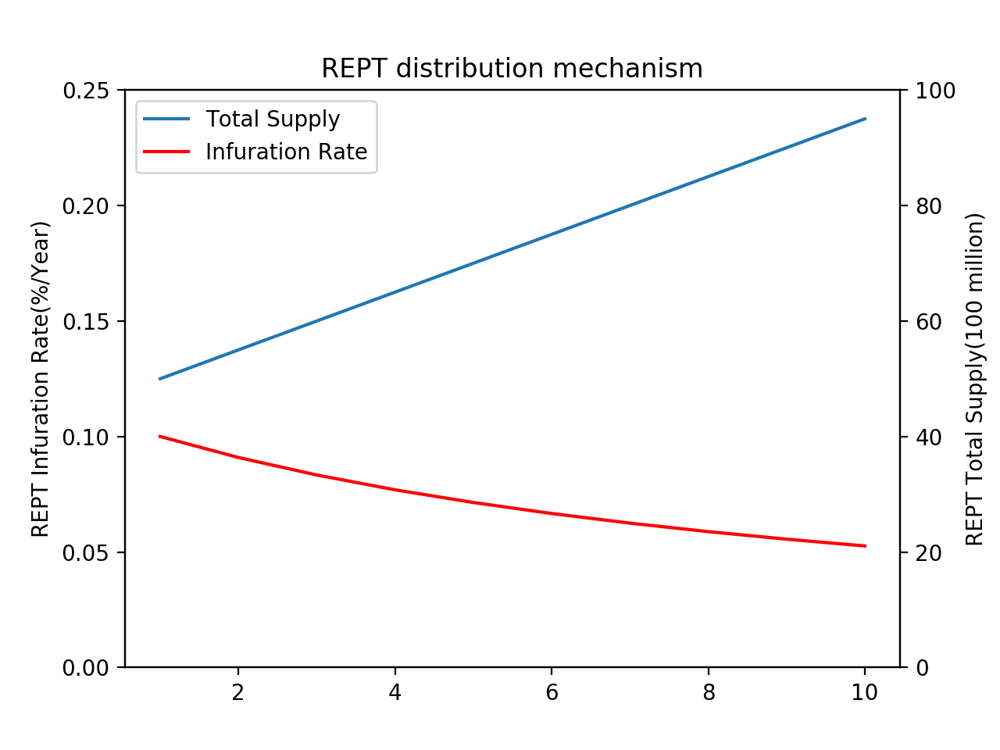

<a id="top"></a>Nibiru Whitepaper

# <a id="abstract"></a>概要

Nibiruは、新たなゲームの開発を支援し、またゲーム内のアイテムや武器、防具など価値あるデータの取引をより簡単にする公平でセキュアな分散型ゲームプラットフォームである。ゲーム内のアイテムや武器、防具などは Nibiru chain 上で独自に定義されたトークンとして市場に流通するようになるため、第三者機関を必要としない取引を可能にする。Nibiruは、従来の中央集権的なゲーム構造とは異なり、トークンの所有権がゲームの運営側に帰属しないため、ゲームという仮想空間内のデータに新たな価値を生み出すものである。仮想空間内に生まれた新たな価値は、今後、より現実的な価値を持ち始め、次第に大きな経済を生み出すものとなる可能性を秘めている。Nibiruにおける取引は、公平性を保ち、ユーザーによる検証が可能で、資金の流れが視認可能であることから、通貨の偽造や二重譲渡といった従来の不正に抵抗する。従来の通貨システムでは、クライアントサーバー型ネットワーク構造を持つ、中央集権的な決済システムであるため、ハッキングなどの外部からの攻撃に弱く、財務規制や煩雑な処理を行う上で多くの手数料がとられていた。P2P 型ネットワーク構造を持つ分散型の通貨システムは、情報が一箇所に留まらず、第三者に依存しないため非常にセキュアで、負担の少ない仕組みであるといえる。

# <a id="introduction"></a>導入
## <a id="vision"></a>Our Vision

Nibiruは、ユーザーが、自らのゲーム内アイテムや武器、防具などの価値あるデータをブロックチェーン上のデジタル資産として自由に管理することができ、それらの取引を自由に、迅速に行えるようにするためのゲームに特化したブロックチェーンネットワークの構築を目指し、開発を進めている。

ゲームに特化した新たな分散システムの構築は、従来型の中央集権的なゲーム産業が抱える「ゲーム空間内のユーザーの経済的行動の制限」を解決することができると私たちは確信している。
具体的にNibiruでは、ブロックチェーンを活用したゲームのUX向上のため、非中央集権的でありながらも、即時決済を可能にする高いスループットを持ち、迅速なファイナリティを得ることができるスケーラブルなブロックチェーンの開発が必要であると考えており、その実現を目指している。

また、Nibiru chainを維持するために、validatorへの適切な報酬体系を設けることで、半永久的に持続可能なエコシステムを構築したい。


## <a id="principles"></a>Nibiruの根本原理
### <a id="sbp"></a> ゲームプレイヤーが恩恵を受ける仕組み

従来のクライアントサーバー型のゲームにおいては、課金やゲームプレイを通じて獲得したアイテムの所有権はプレイヤーに帰属せず、サーバーを管理するゲーム運営会社に帰属していた。従ってプレイヤーは、自らの思惑に沿ってゲーム内アイテムを売買することができないため、ゲーム間の移動時に保持しているアイテムは無価値化してしまう。つまり、異なるゲーム間でユーザーが価値を維持するためには、ゲーム内で獲得したアイテムの所有権がプレイヤー側に帰属する仕組みが必要となる。Nibiru のゲームプラットフォームでは、プレイヤーがゲーム内のアイテムトークンをNibiru ブロックチェーン上で電磁情報として保持することで、ゲーム会社から切り離れた空間においてユーザーがアイテムトークンを保有することができるようになる。さらに、プレイヤーは各アイテムトークンを DEXを通してNibiruプラットフォーム上での流通通貨であるREPTと交換することができるため、これによりプレイヤーは、Nibiruプラットフォーム上のGame A から Game Bに移行する際、所持していたアイテムを一旦REPTと交換することで、従来では無価値化していたアイテムの価値を保持することが可能となり、また、従来ではゲーム会社の規約で禁止されていたRMTが実質的に可能となるのである。進化を続けるゲーム空間内においてデジタル資産が管理されることで多様な経済活動が生まれ、プレイヤーはより自由で魅力的な次世代型分散仮想空間を楽しむことができる。

### <a id="sgdd"></a> ゲーム開発者が容易に開発を行える仕組み
ゲーム開発者の多くは、ゲームの構想や開発技術はあるが、十分な資金がないため開発を進めることができないといったジレンマを抱えている。また、従来の中央集権的な大手ゲームプラットフォームでは、30 ~ 50%にあたる手数料をゲーム開発者からとるビジネスモデルであるため、人気のゲームを開発できる優れた技術を持った技術者や開発者が収益を上げにくい構造となっている。Nibiruでは、従来の構造では大手ゲームメーカーの下請けにすぎなかった中小ゲーム会社や所属する開発者に対し、オリジナルのゲームを開発するためのFunding手段としてICOやIEO、STOなどを行える仕組みを提供し、Nibiruプラットフォーム上では極めて低コストかつ容易にゲームを公開できる仕組みを提供する。また、ゲーム内でのアイテムトークン生成機能をはじめとした全ての機能について、従来のゲーム開発者もサポートするための SDK を準備する。

### <a id="pngg"></a> 次世代型のゲームのあり方を提示する
現在のゲーム業界では、ユーザーはゲーム内のデジタル資産の所有権を持つことはできず、中小ゲーム会社と所属する開発者は大手ゲームメーカーの下請けとなっている。すなわち、一部の大手ゲームメーカーや中央集権的な既存のゲームプラットフォームが収益を得やすい偏向した構造が存在している。また、昨今は e-sports 等で活躍するプロゲーマーと呼ばれるプレイヤーも増加傾向にあるが、一般的にゲームへの没頭は、単なる娯楽であり、生産性がなく現実逃避の手段として見なされる傾向にある。その原因として、ゲーム内で費やした時間やお金がデジタル資産としてプレイヤーの手元に残らないことがあげられる。 virtual な環境で過ごした時間が現実世界でも生かされるのであれば、ゲームに対する世間の見方へ大きな変革をもたらし、ゲーム空間自体も今後益々リアルに発展していくと予測される。さらに次世代のゲームでは、プレイヤーは自らのアイテムの所有権を正式に主張できる権利をもつ、より自立した存在となり、 e-sports の拡大とともにゲームでお金を稼ぐことができるプロゲーマーも一般的になる。また、実際にゲーム開発を行なっている中小ゲーム会社に所属する開発者は、大手ゲームメーカーのブランド力に依存することなく、自律的にプロジェクトチームを編成し、資金調達を行うと同時に、持ち前の技術力を生かして創造性に富んだゲームを開発することもできるようになる。今後、娯楽の重要性が増し、多様化する未来において、プレイヤーの自立化が進むことで、もはや、ゲームをすることがマイナスに働く時代は終わり、ゲームは単なる娯楽に留まらず仕事の一環としてさえ認知されるようになるだろう。分散型のゲームプラットフォームは、従来のゲーム業界が抱える問題への新しいソリューションとなりうる。ゲーム愛好家が真に活躍でき、ゲーム開発者もプレイヤーのニーズにあう新作ゲームを自由に創作できる次世代型分散仮想空間。Nibiru は、こうした新しいゲームのあり方を世界に提示していく。

# <a id="background"></a>背景
## <a id="egi"></a> 急成長するゲーム市場
近年、MOBA(Multiplayer Online Battle Arena)、FPS(First Person Shooter)、RPG(Role-Playing Game) を始めとする、特に MMO(Massively Multiplayer Online) 型の PC ゲームの市場規模は大きく増大し続けている。また、スマートフォンの普及や新たな技術の革新に伴いモバイルゲーム市場や VR ゲーム市場も急速な成長を遂げている。

2015 年には 931 億ドルだった世界におけるゲームの市場規模は 2016 年に 1065 億ドル、2017 年には 1217 億ドルを突破し、2018年には1379億ドルに成長した。また、今後も2019年には1519億ドルに、2020年には1659億ドル、2021年には1801億ドルを突破すると予測されている。インターネットの発達はオンライン通信を容易にし、多様なコミュニティをゲーム空間上に生み出した。ARやVR 技術によりリアルなゲーム空間が実現され、ゲームは益々現実世界へと近づいている。


## <a id="ifcgi"></a> 現在のゲーム業界の課題
従来のゲーム構造下において、ゲーム内アイテムはゲームの運営側に所有権が帰属しており、ユーザーはゲーム内のアイテムを自分の資産として保有することができない。単一のゲーム内で手に入れたアイテムはあくまでそのゲーム内における電磁情報に過ぎず、複数のゲーム間で価値を移動させることはできない。ゲームに対して当てられた時間や資金は、単一のゲーム空間内でしか通用しないものである。またゲーム内アイテムの売買はほとんどの運営会社が利用規約上で明確に禁止しており、ユーザーが単一のゲーム空間を超えて価値を持つ電磁情報を資産として保有することは困難を極める。結果としてゲーム空間内におけるユーザーの経済的行動は制限されていた。ゲーム内における電磁価値の換金はRMT(Real Money Trading) と呼ばれているが、RMT は中央集権構造をとった多くの既存のゲームにおいて規約上明確に禁止されている。しかしながら本市場の潜在的な市場規模は数兆円以上であると予測されており多くの需要が存在する。ゲームの開発に際しても、既存の枠組みではゲームの公開手段は中央集権的企業に多くの掲載手数料を取られるわずかな手段に限られており、一層魅力的な次世代の仮想空間の発展と創造促進のため、電磁価値の移転と決済執行を内包するゲーム空間が要求されている。Nibiruはゲーム内データの一部（ユーザーの所有権及びアイテムの特性など）をブロックチェーン上で管理することによって、分散的に構築された第二の世界としての仮想空間内における非中央集権的取引を実現する。プレイヤーは、中央集権機関の制限やそれ特有の問題に縛られることなく、ゲーム内のアイテムをデジタル資産として保有し、自由に売買を行い、利益を享受できるようになる。昨今世界では、RMT 専門の取引所を作る動きもあるが、Nibiruでは従来の中央集権構造を用いず、次章で説明するブロックチェーン技術を用いることで分散型ネットワーク上にて RMT が実行される仕組みを構築し、各ゲーム愛好家の多様な経済活動を促す「プレイヤーのプレイヤーによるプレイヤーのためのプラットフォーム」としての次世代型分散仮想空間が形成される。

## <a id="egt"></a> ブロックチェーン技術の登場
2008年にナカモトサトシが発表したホワイトペーパー「Bitcoin: A Peer-to-Peer Electronic Cash System」[<a href="#ref-1">1</a>] を端緒として開発された Bitcoin は通貨・貨幣における革新的な発明だと謳われ、金兌換のような後ろ盾もなく中央通貨管理局を持たない初めてのデジタル資産の例である。Bitcoin 管理形態の基盤として用いられたブロックチェーン技術は、CPUの計算能力とシンプルなアルゴリズムを採用することで分散型ネットワークによる台帳管理を可能にするものである。Ethereum Foundation により進められている Open-sourceプロジェクトである Ethereum[<a href="#ref-2">2</a>] は、チューリング完全な拡張用言語を備えた次世代型スマートコントラクト分散アプリケーション基盤である。Bitcoin や Ethereum に代表される主要な暗号通貨はブロックチェーン技術を基礎としている。電磁情報の暗号化、Timestamp、コンセンサスアルゴリズムと経済的インセンティブ構造により、互いを信用する必要なく各ノードが P2P 取引を処理し、分散型台帳を管理するようになった結果、中央集権的機関の存在により生じる高費用、非効率性、電磁情報記憶の安全性に関する問題を解決する。ブロックチェーン自体は全く新しい技術ではないが、P2P 通信、暗号化技術、チェーン上のデータ構造などの技術を組み合わせたイノベーションであるといえる。

# <a id="problems"></a>課題
##<a id="ifbi"></a> ブロックチェーンにおける課題
分散的な統治システムの開発により多くの人が集まり、ブロックチェーンプロジェクトは世界的に増加を続け、多くのアプリケーションが開発されている。単なる電子通貨から、Ethereum を基盤としスマートコントラクトを内包するアプリケーションや Ripple に基づく地球規模の決済システム層の構築に到るまで多様なユースケースが生まれるにあたり、ブロックチェーン自体にも多くの需要や課題が生じている。 多くのソフトウェアとは異なり、クライアントやプロトコルの更新をユーザーに対し要求できない分散型ブロックチェーン体制ではプロトコルの更新に乗じてコミュニティへの多くの損失に繋がる”ハードフォーク”や”ソフトフォーク”が生じ、システムが大きく制限される。Bitcoin では、コミュニティ内でブロックのスケーリングに関する論争が未だに続き、Bitcoin プロトコルの発展を阻害している。Bitcoin ブロックチェーンの収容能力が限られていることで百万を超える取引が滞留するに事態も繋がっており、ユーザーは余分に高価なトランザクション促進手数料の支払いを迫られている。 Ethereum においても The DAO 問題への対処としてのハードフォークによりコミュニティーが分裂し、ユーザーエクスペリエンスの低下をもたらしている。世界的な暗号通貨に対する投機熱の高まりに伴い、本質的にブロックチェーンを必要とせず誇大広告を行うプロジェクトが乱立する中、これらの課題を解決し将来的に分散型社会を実現できるユースケースが求められている。

## <a id="pcca"></a> コンセンサスアルゴリズムの問題点
導入にて前述した、ゲーム空間内におけるユーザーの経済的行動の制限を解決するために、非中央集権的でありながらも、即時決済を可能にする高いスループットを持ち、迅速なファイナリティを得ることができるスケーラブルでゲームに特化したブロックチェーンの構築を行うという、我々のvision を達成する上では、現在広く使われているPoWやPoSといったコンセンサスアルゴリズムでは、不十分である。PoWでは、多大な計算量を要するハッシュ計算を最初に解いたノードにブロックの生成権が与えられ、その後、生成されたブロックの承認作業が各ノードの多数決により行われるといった仕組みである。しかし、PoWには、取引量の増加により Difficulty が上昇することで、ブロックの承認作業に、スーパーコンピューターや大型サーバーなどのハイスペックマシンが必要となるという問題や莫大な電力消費が必要になるという問題、51% 攻撃を受けやすいといったような様々な問題が存在する。特にPoWでは、不特定多数による承認作業を行う必要があるため、必然的に承認作業に時間がかかってしまうといった問題があり、即時決済性が求められるゲームにおいては、適していないと言える。 また、PoS は、coin age や保有量に応じて、承認する権利が与えられる仕組みであるため、初期資本が多い人が優先的にブロックの生成を行えるため、結果として一部の保有者の寡占を招くことになるとともに、通貨自体の流通量が減少してしまうという可能性をもっている。PoSでは、比較的簡単にブロックを生成することが可能になるので、不正なブロックをリスクなく生成できるという Nothing at Stake 問題も存在している。しかし、その一方でPoWに比べ、電力消費量が少ないこと、ブロックの生成に高度な計算を必要としないため処理速度が速いこと、51％攻撃のリスクを減らすといったメリットも存在するが、ゲームにおける迅速な取引という観点からは不特定多数のノードが存在しているため、スループットの能力も十分であるとはいえず、ファイナリティを即時に得られないといった問題が存在している。

## <a id="ietps"></a> Ethereumの問題点とTPSの必要性
Ethereum は、Bitcoin で用いられたブロックチェーンがチューリング完全な拡張用言語を埋め込むことで次世代スマートコントラクトを実現した。実際に Ethereum を基盤とした多くの分散型アプリケーションが開発されている。UTXO(Unspent Transaction Output) によって通貨を表現しているBitcoinとは異なり、Ethereum は状態遷移をブロックチェーンに格納することでデータを保存しているが、その「状態」は「アカウント」と呼ばれるオブジェクトによって表される[<a href="#appendix-a">付録 A</a>]。 アカウントは、秘密鍵により管理される EOA(Externally Owned Accounts) と自身のコントラクトコードにより管理される Contract Account に分類される。二種類のアカウントのデータは状態遷 移関数を用いてブロックチェーン上に保存されており、ある条件が整った時にのみ実行されるようなスマートコントラクトを実装することができる。Ethereum は、究極的な抽象化された基盤層としてあらゆる分散型アプリケーションを実装可能なプロトコルを構築した革新的なプラットフォームであるが、より多くの人が Ethereum ネットワークに参加するにあたって多くの課題も生じている。

Ethereum ネットワークは、全ての分散型アプリケーションを実装可能にするようなプラットフォームであるため、ゲーム以外のあらゆるプロジェクトが同時に Ethereum 上で開発を進めている。そのため Ethereum ネットワークは大量のトランザクションを処理する必要に迫られており、取引が増大した 2018 年に最大で 3 万件もの未確認取引が生じ、取引手数料は高騰した。TPS(Transaction per Second) に着目すると、Bitcoin に比べれば改善されているものの、１秒間に7 から 8 トランザクションというEthereum の数字は今後増大が予測されるネットワークに対して明らかに不足しており、また即時決済性が要求されるゲーム産業においては大きくUXを低下させることに繋がる。オフチェーン技術などを用いた改善案が議論されているが、実装の時期や実現可能性は不透明である。加えて、The DAO 問題への対処としてシステムがロールバックされたことやハードフォークによるコミュニティの一部分裂が起きたことも留意すべき点である。Ethereum の利用は、いくつかの問題点と様々なプロジェクトが介入することによるリスクを内包しており、Nibiru が目指す自由な仮想空間の実現にはゲームに特化したユーザーエクスペリエンスの高い新たな枠組みが必要である。


## <a id="psc"></a>Smart Contractが抱える課題

Ethereum上のブロックチェーンゲームと言えば、2017年12月にEthereum上で実装された、猫の育成ゲームであるCryptoKittiesが記憶に新しい。ERC721で表現されたKittiesの所有者は、そのトークンを持つ者であるということがEthereum上で保証されている。したがって、ユーザーは、そのKittiesをマーケットで販売したり直接友達に送ったりするもできる。この、「ユーザーにデジタルアセットの所有権が帰属すること」こそが従来のゲームとブロックチェーンを利用する次世代型のゲームの大きな違いになるだろう[<a href="#appendix-b">付録 B</a>]。CryptoKittiesは、従来型のゲームとの差異を示した一方で、ブロックチェーンゲームが潜在的に抱える問題点も浮き彫りにした。CryptoKittiesが流行した当時、Ethereum上ではtransactionの詰まりが発生し、gasが高騰する原因になった。また、現在だと、openZeppelinが提供するERC721の規格は固まっているが、当時は、仕様が固まっていなかったので、KittiesのContractでは、TransferのEventの時にindexが付与されていない。このため、あるアドレスを含むTransactionの検索行うなどと言ったことがブロックチェーン上でできないため、別のデータベースでトークンの管理をする必要がある。kittiesのコントラクトはすでにdeployされているため、このコントラクトを直接変更することはできない。

以上のことからわかるように、Ethereum上でゲーム用のアイテムを実装しようとした時に、次のような問題が生じる。

-	コンパイラ言語の制約を受ける

スマートコントラクトは通常、基礎となる仮想マシンで解釈できる特定のプログラミング言語で開発されている。これらのプログラミング言語はしばしば未熟で仮想マシンの制約によって本質的に制限されてしまう。たとえば、Ethereum仮想マシンでは、開発者はコードの自動実行を実装できない。開発者はEVMのアカウントベースのシステムにも制限されており、彼らは自分の暗号操作のために限られた機能セットからしか選択できない。これらは一例にすぎないが、スマートコントラクト環境にはしばしば伴う柔軟性の欠如を示している。

-	他のプロジェクトとの競合に伴うパフォーマンスの低下

スマートコントラクトはすべて同じ仮想マシンによって実行される。これは、彼らがリソースをめぐって競合することを意味する。また、ステートマシンが複数のサブセットに分割されたとしても（たとえばシャーディングによって）、スマートコントラクトは仮想マシンによって相互運用される必要があるため、ステートマシンレベルで実装されたネイティブアプリケーションに比べてパフォーマンスが制限される。

-	updateできないので拡張性が低い

スマートコントラクトが基礎となる環境を共有しているという事実に伴うもう1つの問題は、その結果として生じる主権の制限である。分散アプリケーションは、複数のプレイヤーが関与するエコシステムである。アプリケーションが汎用の仮想マシンブロックチェーン上に構築されている場合、これらのプレーヤーの主権は非常に限られており、最終的には基礎となるブロックチェーンの管理に置き換えられる。ブロックチェーン側にバグがあったとしても、それについてできることはほとんどないと言える。

また、Kittiesを表現したERC721のトークンは、ゲームアイテムとしてというより、将来的に誰かがより高い価格で買い取ってくれることを期待した金融商品的な位置付けになっている。これは、本来、ゲームの中で価値が生まれるゲームアイテムがP2Pで取引されるという性質ではないため、本質的なゲームとしての面白さを引き出すのは難しい。ゲームの面白さに立脚したアイテム(言い換えると面白いゲームの中で使用価値があるアイテム)だからこそ、仮想世界の中で価値があるものになる。

加えて、このようなERC721の代替不可能性を利用したデジタルアセットはたくさんあるが、今後ブロックチェーンゲームの真価が発揮されるのは、キャラクターのみではなくゲーム内のアイテムまでブロックチェーン上で取引される時であると考えられる。そのためには、Fungible tokenで表現されたゲーム内アイテムとNon-Fungible tokenで表現されたゲームキャラクターの両方を自由に交換できるプロトコルが必要になってくる。

# <a id="solutions"></a> ソリューション
## <a id="nh"></a> ゲームに特化したNibiru Hub
Blockchain を利用するゲームの中心となるようなHubを形成することによって、各ゲームに沿った拡張性が高いブロックチェーンが実現できるほか、Nibiru network上でそれぞれのゲームのアイテムトークンの交換をはじめとした有機的な成長が期待できる。


## <a id="bgsb"></a> ゲームに特化したブロックチェーンの利点
Nibiruは、ゲームに特化したブロックチェーンをTendermint[<a href="#ref-3">3</a>]を利用して構築することを目指している。独自チェーンを利用することで、次のようなメリットを享受することができると考えられる。

- 柔軟性

tendermintは、ABCIと呼ばれる規格に沿ったインターフェースを自由に実装することができるので、blockchain上でのstate-machineを独自に実装することができる。また、アプリケーション側で、validatorの数やgasの設定、トークンモデルの選択などを自由に行うことができる。

- パフォーマンス

PoWと比べて、PoSなので圧倒的なTPSを実現することが可能になる。Ethereumと違って、他のプロジェクトとリソースを競合する必要がないのも大きなメリットの一つと言える。

-	セキュリティ

仮想machineで起きるバグを心配する必要がないので、アプリケーション上の開発に集中することができる。

-	メンテナンス

Ethereumだと様々なステイクホルダーが関係するために、容易にバグを修正することはできないが、tendermintベースの独自チェーンだとコミュニティ内でのガバナンスを通して、合意のもとバグの対応することができる。また、ゲームアイテムの仕様が変更になったなどの場合の時も、容易にupgradeすることができる。


## <a id="rept"></a> Token Model
Nibiru Network はマルチアセット分散元帳であるが、Nibiru Govenance Token (NGT) と呼ばれる特別なネイティブトークンがある。 NGTはNibiru Hubの唯一のステーキングトークンである。 NGTは、所有者がvalidatorに投票、検証、または委任するための権利を保有していることを表している。 また、Nbiru Hub上で流通するトークンには、REPTがある。これは、EthereumのETHのように、スパムを軽減するために取引手数料の支払いに使用することができる。ブロック報酬は、バリデータとバリデータに委任するデリゲータにREPTとして与えられる。

### <a id="dis"></a> REPT 分配メカニズム
新しいBlockが生成されるごとに、validator、およびdelegatorは、NGTのstake量に応じてPERTをブロック報酬として得ることができる。REPTの上限は、100億トークンであり、初期のREPT分配量を50億とした時、毎年5億REPT分がBlock報酬となるように調整する。したがって、今後10年間のインフレ率は10%から5%の間で推移することになる。上限に達したとき、validatorのブロック報酬はなくなり、トランザクション手数料のみがvalidatorおよびdelegatorの報酬となる。




###<a id="vm"></a> Validator Management

Nibiru Hubは、新しいブロックをCommitする責任を持ったvalidatorに依存するTendermintを使用して構築される。validatorは、フルノードを実行し、また各々の秘密鍵で署名した暗号署名を含む投票をブロードキャストすることを通して、コンセンサスに参加している。ネットワーク内の誰でもvalidatorに立候補することでvalidatorの候補者になることができ、自分のNGT（任意の数量）とdelegate（委任）されたNGTのstake量によって、Network内で決定された上限までのノードがNibiru Hubのvalidatorになることができる。validatorとdelegatorは、ブロック生成時に報酬としてREPTを受け取れるほか、Tendermintコンセンサス実行時に、トランザクション手数料をREPTで受け取ることができる。また、Nibiru Hub上のvalidatorとDelegatorはblock gas limitなどのパラメータの変更や、アップグレードの調整、Nibiru Hub の仕組みの改正に対して投票することができる。

validatorはガバナンスシステムにおいて特別な役割を果たし、全てのproposalに対して投票する必要がある。また、投票しないdelegatorの分はvalidatorに引き継がれることになる。もし、validatorによる二重署名が発覚した場合や、度重なるオフライン状態、運営への不参加などが見られる場合、ステークされたNGT(delegateされたものも含む)はその重要度に応じてslashされる。なお、validatorは、delegatorに対して任意の手数料を設定できる。


## <a id="consensus"></a> Consensus Algorithm

### <a id="bft"></a> BFT systems
BFT[<a href="#ref-4">4</a>]  は、PoW や PoS のデメリットであったファイナリティの不確実性や性能問題を解消している。BFTでは、PoW や PoS と異なり、validator による意思決定をした後にブロックを生成するため、ブロックチェーンの分岐が発生しない。したがって、一度確定したブロックが覆らないので、ファイナリティが確保されることになるとともに、PoW のようにNonceを見つけるまで計算をし続ける必要はないので、性能的にも非常に高速な仕組みになっている。

Byzantine Fault Tolerance は、n 個のノードによるコンセンサスシステムに関して、f = (n-1)/3 のフォールトトレランスを提示する。コンセンサスを誤ったノードが「(n-1)/3」を超えないようにすることで、システムの機能性と安定性が保証される。ブロックチェーンの総台帳はvalidator ノードによって維持され、通常のノードはコンセンサスには参加しないことで、全体の合意形成の手続きを効率化する。このトレランスキャパシティは、セキュリティとユーザビリティを確保し、あらゆる環境に適している。


### <a id="tendermint"></a> tendermint BFT Algorithm
Nibiruでは、上記の既存のコンセンサスアルゴリズムの課題を解決し、強固な耐障害性をもつとともに、ファイナリティの確保ができるBFT-based PoSのtendermintをコンセンサスエンジンとして利用しようと考えている。Tendermintは、複数のマシンでアプリケーションを安全かつ一貫して複製するためのソフトウェアである。安全であるということは、最大1/3のマシンが任意の方法で機能しなくてもTendermintが機能することを意味すると同時に、一貫してすべての故障していないマシンが同じトランザクションログを見て同じ状態を計算する。安全で一貫したレプリケーションは、分散システムにおける基本的な問題である。これは、通貨から選挙、インフラストラクチャオーケストレーション、そしてそれ以降まで、幅広いアプリケーションのフォールトトレランスにおいて重要な役割を果たす。 Tendermintは、ブロックチェーンコンセンサスエンジンと汎用アプリケーションインタフェースという2つの主要な技術コンポーネントで構成されている。Tendermint Coreと呼ばれるコンセンサスエンジンは、同じトランザクションがすべてのマシンに同じ順序で記録される。アプリケーションブロックチェーンインタフェース（ABCI）と呼ばれるアプリケーションインタフェースにより、トランザクションを任意のプログラミング言語で処理することができる。開発者はあらゆるプログラミング言語で作成されたアプリケーションのBFTステートマシンレプリケーションにTendermintを使用することができる。 Tendermintは、使いやすく、理解しやすく、高性能で、さまざまな分散アプリケーションに役立つように設計されている。 Tendermintを利用することで次のような利点がある。

-	1秒当たり数千トランザクションを扱える
-	ブロック生成後すぐにファイナリティを得られる（一度承認されたトランザクションは覆らない。これはBFT性を持った投票型のコンセンサスなため）
-	あらゆるプログラミング言語でブロックチェーンプロトコル周りを開発することが可能
-	パブリックチェーンでもプライベートチェーンでも実装可能
-	ネットワーク参加者の1/3以上が悪意を持っていない限り安全

次にtendermintで実装されたアプリケーションのトランザクションの処理及びコンセンサスの取り方について見ていく。


-	アプリケーション側のユーザーによって、トランザクションが生成され、アプリケーションのクライエントからデーモンに対してデータの書き込みが行われる。
-	デーモン側でクライアントの要求を受け取り、Mempool Cacheにトランザクションを流す。
-	CheckTxを使ってアプリケーションロジック側でトランザクションの検証が行われる(mempool コネクション)
-	検証をpassした場合、トランザクションはmempoolに移動し、検証を通らなかったトランザクションは棄却される
-	validator(proposer)によって提案されたブロックがtendermintの3相コミットのアルゴリズムに基づき他のvalidator間でコンセンサスが取られる
-	validatorは、abci-cliを使って、BeginBlock, DeliverTx…EndBlock, Commitをアプリケーションロジック側に送る(consensus コネクション)
-	アプリケーションロジック側では、トランザクションの状態更新・validator setの更新を行い、その情報をtendermint側に返す
-	各validatorは、新しいブロックを自身のDBに格納する。

興味深いことに、tendermintではすでにブロックの形式は決まっており、アプリケーション側はABCIを実装することを通してそれに合うような形式のトランザクションを生成する必要があるということだ。そうすれば、どのようなトランザクションであっても、tendermint上では規定された通りのブロックが生成されることになり、コンセンサスレイヤーにおいて、アプリケーション側は、簡単な実装が可能となっている。


## <a id="nf"></a> Nibiru Functions
### <a id="wa"></a> wallet and account
現在、暗号通貨の取引を行う際ユーザーは専用のウォレットを用意し利用しているが、煩雑な作業が多くゲームプラットフォーム上で既存のサービスを利用するとプレイヤーのUXを著しく低下させる。しかし、Nibiru 上の Wallet は、ゲーム上で利用される ID と紐づけられることでプレイヤー間での取引を容易かつ迅速に行うことを可能にする。 Nibiru wallet は、Nibiru プラットフォーム上で発行された全てのトークンをサポートし、REPT はもちろん、各ゲーム内のアイテムトークンなどを安全に保管することができる。また、通常の wallet サービスと同様に、REPT やアイテムトークンを Nibiru wallet をもつ第三者のアドレスに送ることができることの他、Nibiru DEXにアクセスしてユーザー間でアイテムトークンの売買を行うことができる。

Nibiru プラットフォーム上でゲームをプレイするためには、ユーザーは、まず Nibiru wallet を生成する。wallet を生成すると、各ユーザーには Nibiru ID が割り当てられる。ユーザーは、Nibiru ID と wallet 生成時に入力したパスワードを入力し wallet にログインすると、REPT 及びアイテムトークンの残高管理と登録済みのゲームのアカウントの設定を同時に行うことができる。wallet とゲームアカウントは、Nibiru ID を通して紐ずけられており、wallet にログインした段階で、ユーザーはゲームアカウントにも同時にログインすることになり、ワンタッチで Game 画面への切り替えを行うことが可能になる。ゲームアカウントと wallet の機能を統合させ、Nibiru ID で紐づけることで、ユーザーは従来のようにゲームアカウントと wallet の管理を別々に行う手間（ゲームアカウントと wallet に別々にログインする or アイテムトークンの取引やアイテム購入時に wallet にログインをする）を省くことができ、ユーザーエクスペリエンスを高めることができることができる。既存のゲームに関しても、ゲーム会社側がアイテムトークン生成機能を備える SDK を組み込むことによって、 Nibiru chain 上で管理可能なアイテムをゲーム内に登場させることが可能になり、ゲームの多様性が広がる。その際、Nibiru wallet に登録していない従来のユーザーも新しく Nibiru wallet を生成するだけでアイテムの売買に参加することができる。さらに、Nibiru wallet にチャット機能や友達機能、グループ機能を搭載することで、ゲームの垣根を超えたプレイヤー間の交流が活発に行われる。


### <a id="it"></a> Item Token
アイテムトークンの生成は、プレイヤーがデジタル資産としてのゲーム内アイテムの所有権を保持し自由活発に取引が行われる次世代型分散ゲームプラットフォームを最も特徴付ける機能である。従来運営側のサーバーで保持されていたゲーム内アイテムは、ブロックチェーン技術を用いることで、それをデジタル資産として所有するユーザーによって管理・譲渡・売買され、仮想空間としての第二の世界に大きな経済圏を生み出す。
アイテムトークンには二種類のものがある。Fundible(代替可能) トークンと Non-Fundible(代替不可能) トークンである。前者は、ゲーム内に多数存在するポーションのようなアイテムに利用される、 Ethereum 上における ERC-20 トークンに対応するものである。Fundible トークンとなったゲームアイテムは、一つ一つに代替可能性があり、例えば Aliceの持っている 1 トークンと Bob の持っている 1 トークンは全く同値のものである。しかしながら、多くのゲームには個体値を持つユニークなゲーム内アイテムが存在し、ゲーム空間をよりエキサイティングにしている。ユニークな Level や攻撃力、スキル等を持つゲーム内アイテムはメタデータとしてそれらのステータスを保持し、Non-Fundible トークンとなる。これは Ethereum 上における ERC-721 トークンに対応するものであり、世界に一つしかない代替不可能なトークンとなる。この時、Alice の持っている 1 トークンと Bob の持っている 1 トークンは等価交換できるとは限らない。いずれのアイテムトークンに関しても、ユーザーは Nibiru 上でデジタル資産として所有することができ Nibiru DEX 等を利用することで容易に取引が可能となる。また Nibiru では、ゲーム開発者が容易に両トークンを発行可能となる仕組みを SDKとして用意する。


### <a id="dex"></a> Nibiru Dex and Auction
現在の仮想通貨の取引の多くは、運営主体がいる取引所を介して行われている。取引所の意思決定において、中央集権的な手法を用いるため、こうした取引所のことを Centralized Exchange と呼ぶ。ユーザーは、自分のウォレットから取引所のウォレットに資産を送り、取引所内のデータベースによってユーザーの資産残高の管理が行われる。そして、資産自体は取引所が保管する形になる。したがって、ユーザーは、取引所を信頼（トラスト）する必要があり、自分のデジタルアセットは完全に第三者（取引所）に依存している状態になっている。中央集権的な取引所では、実際に取引所がユーザーの資産の持ち逃げをしたり、ハッキングにより顧客の資産が流失してしまったりする事件が後をたたない他、単一障害点が存在するため、アクセス集中や DDoS 攻撃などによって、ブロックチェーンではなく、取引所のサーバーがダウンし、取引ができなくなる恐れもある。

一方、運営主体が存在せず、スマートコントラクトで実行される取引所のことを Decentralized Exchainge と呼ぶ。ユーザーは常に自分で資産を管理し、交換する際には、ユーザーは自分のウォレットからコントラクトアドレスにトークンを送りデポジットするので、第三者を信頼せず(トラストレス)に取引を行うことができる。しかしながら、Centralized Exchange に比べて、ユーザー数が少なく流動性に欠けているため、実用化されているとは言い難い[<a href="#appendix-c">付録 C</a>]。

上記の現状を踏まえて、Nibiru 上では、第 3 者機関を介さない、アイテムトークンの分散市場を実現するために、Nibiru DEX を構築しプレイヤー同士が自由にアイテムトークンを売買できる環境を整える。Nibiru DEX では、REPT を基軸通貨として、Nibiru プラットフォーム上のあらゆるアイテムトークンを交換することができる。したがって、Alice は game A のアイテムトークンを売却して Game B のアイテムトークンを購入することで Game B でもアイテムを利用することができる。アイテムトークンと REPT の交換比率の決定は市場原理に基づき、市場価格は需要と供給が一致する価格で均衡する。希少性が高いアイテムほど高値がつく仕組みになり、仮想空間の中でプレイヤーによる経済活動が活発化するにつれて、Nibiru DEX でのアイテムトークンの売買を介して virtual な経済圏が構築される。Nibiru DEX に関しても、流動性がないと実用性に欠けるため、現在進行中のプロジェクトである、自動的にトークンの価格と流動性を決めるメカニズムを採用し即時決済が可能になる Bancor protcol[<a href="#ref-5">5</a>] と言った技術の導入も検討している。

また、アイテムトークンの中でもさらに希少性がある発行枚数が数枚といったレアなアイテムトークンに関しては、DEX では買い板と売り板が十分ではないため、Nibiru Auction という仕組みを導入して、時間制約を設けた入札による競売を行う。あらかじめ決められたオークション形式に従うため、アイテムトークンを売却したいプレイヤーは、入札の締め切りを決めておくだけで、入札金額が高いプレイヤーにアイテムを売り渡すことができる（単一価格封印入札モデル）。

### <a id="et"></a> Player間のエスクロー取引
ゲームコミュニティを通して親しくなった第三者と直接取引をしたい場合は、Nibiru 上に設置されたエスクロー取引を利用することで、不正な取引を防止することができる。わかりやすい例を考えてみよう。AliceとBobがゲーム内のチャット機能などを通して友達になり、Aliceが保有している game A 内のアイテムとBobが保有しているGame B 内のアイテムを交換したいということで両者の合意が取れたとする。単にAliceからBobへアイテムトークンを送信することは可能だが、万が一、Bobに悪意があった場合、Aliceはgame A 内のアイテムを送ったのに、Bobから gameB 内のアイテ ムが送信されてこないといった詐欺被害を受ける可能性がある。Nibiru 上では、独自で実装したモデュールを利用することでエスクロー取引が可能になっており、AliceとBobは、お互いにエスクロー専用のアドレスにアイテムトークンを送信し、両者のアイテムトークンの入金が完了した時点で、モジュールで定義されたアイテムトークンの振替送信関数が自動執行され、Aliceの元には gameBのアイテムが、Bobには GameA のアイテムトークンが送信される仕組みになっている。また、Bobが決められた時間内にエスクローアドレスに gameB のアイテムトークンを送信しなかった場合、Aliceにはそのまま GameA のアイテムトークンが返却されるように決めておくことで、一方の不正を未然に防ぐことができる。

### <a id="funding"></a> Nibiru Funding
現在、MMORPG やソーシャルゲームの開発の多くは、大手ゲームメーカーの下請けの中小のゲーム会社が行なっているが、mobile ゲームをはじめとして、個人でも簡単にアプリケーションを構築することができるようになってきており、従来のように、大手ゲームメーカーに所属しないとゲームを作れないといった状況は変わりつつあると言える。 Nibiru 上では、個人のゲーム開発者や資金力に乏しい中小のゲーム会社をはじめとして、誰でもゲームプロジェクトのチーム募集や資金調達を目的としたFundingを自由に行うことができる仕組みを作る。ICOやIEO、STOといったFundingを行うゲーム開発者は、コミュニティに対して新作ゲームの構想や出資者へのメリットを明確に提示したホワイトペーパーや企画書を提出する。ユーザーは、コミュニティー内での厳密な精査・議論のもと、各自の判断に基づき、そのプロジェクトに出資をするかどうかを決める。出資者は、Fundingを行うゲーム開発者が用意したアドレスに REPT を送金し、ネイティブトークンを受け取る。ネイティブトークン保有者は、ゲームがローンチした際にレアアイテムを優先的に獲得できる権利がある、あるいは、ゲーム売り上げの X% を自動的に REPT で受け取ることができるなどのFundingを行う側がはじめに提示した様々なメリットの恩恵を受けることができる。このFundingの仕組みによって、出資社側は、新しいゲームを応援することができ、開発者側も資金調達を行い、円滑に開発を進めることができる。このようなシステムはNibiru 上に新しいゲームが次々と載ってくるサイクルを形成することができるとともに、新規ユーザーの獲得に繋がり、Nibiru プラットフォームの成長に貢献する。

従来のようにゲームのファンドを組成した場合には、投資家が配当を得られるのは、決算後の利益のうち数％である。ゲーム会社は、できるだけ投資家への配当を減らすべく、経費として出費を増やすインセンティブが働く。また、実際に投資家に配当が回ってくるのは、数ヶ月後というのは珍しくなく、投資家によるゲーム業界への投資の足枷となっている。

しかし、Nibiru Fundingを利用することで、ゲーム開発者は効率よく資金調達をして、自分でプロジェクトチームを編成しゲーム開発にあたることができる。投資家も、ブロックチェーンを利用した trustless な仕組みのため、開発者側の不正などを心配することなく積極的にゲームプロジェクトを投資の対象とみなすことができる。このとき、Nibiru Fundingで発行されるネイティブトークンは、セキュリティトークンと見なされ、各国の法律に抵触する恐れがあるので、ゲーム開発者は、地域ごとの法律に従う必要があり、例えば、ライセンスを持った従来のファンド組織との協力して Fundingを行うなどの工夫が求められる。


### <a id="sdk"></a> Nibiru SDK
全てのゲーム開発者がNibiruのコミュニティに参加し、分散型ゲームプラットフォームを創ることができるように、従来の開発者が容易に参加できるようなSDK を用意する。例えば、現在実際に多くのゲーム制作に利用されているソフトウェアにUnityやUnreal Engine がある。これらのソフトウェアを利用して制作されたゲームアイテムのトークン化の SDK を用意することにより、従来ゲーム制作に従事してきた開発者が Nibiru と容易に繋ぎこみを行うことができるようになる。既存のプラットフォーム上で決済システムを導入する際、その手数料として30~70% 以上の支払いが要求されたが、NibiruのSDK を利用した決済には手数料がかからない。


# <a id="conclusion"></a> 結論
ブロックチェーンは、中央集権的な第三者機関を介さずに P2P(Peer to Peer) で取引を承認することができる技術で、ビットコインを中心に発展してきたものの、改竄耐性と高可用性を持ち、業務コストの大幅な削減を可能にする新しい技術として各界で注目を集めている。送金や決済の面ではもちろん、その他にも国際送金や IoT への応用も試みられており、現に様々な分野で実証研究が進んでいる。しかしながら、どの事例をとってみても実用化されているというには程遠く、まだまだ発展途上であるのが現状である。2017 年には、様々なブロックチェーンプロジェクトがローンチし、ICO による資金調達が盛んに行われた。しかし、一部では、ブロックチェーンを使う必要がないのに、無理やりブロックチェーンと関連づけることで ICO により多額の資金調達を行う、詐欺的なプロジェクトも存在した。ブロックチェーンの本質的な価値は、”trustless”かつ”permissionless”であるのにも関わらず、それを無視したプロジェクトは、既存の仕組みと変わりなく、次世代を作る革命をもたらすものとは言えない。ブロックチェーンの意義を真に理解した上で、ブロックチェーンプロジェクトの命運を握るのは、プロジェクトを支えるコミュニティの存在、token の利用価値、そして、product そのものといっても過言ではない。コミュニティは、本質的に、オープンソースで、非営利であるという信念を持った bottom-to-top のエコシステムであり、既存の top-to-bottom のビジネス的なエコシステムとは全く異なる。token は、価値の所有権を表すものであり、単なる電子データでありながら、仮想世界に新しい経済圏を生み出す重要な役割を持つ。product は、ブロックチェーンを利用した技術的な成果物そのものである。コミュニティの存在やトークンの価値がない場合、たとえ、pruductだけできたとしても、それは、ブロックチェーンプロジェクトの魅力を十分に引き出しているとは言えないのである。ブロックチェーンのユースケースが乏しい状況下で、数あるブロックチェーンプロジェクトの未来を決めるのは、ユースケースとして確立したプロジェクトの存在である。

ブロックチェーンプロジェクトである Nibiru は、世界的にブロックチェーン技術の実用化が試みられている中で、ゲームに関するユースケースとしての地位を確立するために、実用的な価値に基づいたブロックチェーンや付随する拡張アプリケーションを構築していく。これを達成するためにも、Nibiru はユーザーにアイテムの所有権を確立すべく、ゲーム内のアイテムトークンの実現に注力するとともに、ユーザー間のトレードを円滑にするための Nibiru DEX、ゲーム開発者向けの Nibiru 内のFundingシステムならびに SDK の開発を行う。Nibiru は、コミュニティ主体の運営を行うとともに、NGTとREPT を Nibiru 内の基軸通貨として扱うことで、token に価値を付与し、従来のゲームのあり方を変えるような分散型ゲームプラットフォームを創り上げ、仮想世界でのトークンエコノミーを実現する。

一方で、Nibiru は新しいゲームのあり方を社会に提示する役割も担っている。どんなゲームをやってもすぐに「飽き」がやってくるのは、ゲームの先にあるものを見失っているからかもしれない。所詮ゲームは、娯楽の一部に過ぎず、現実世界とは無関係な空虚なものに過ぎないという思い込みに支配されているからかもしれない。しかし、e-スポーツの発展に伴い、世界中で従来のゲームのあり方が見直されてきている。また、ブロックチェーン技術を使うことで、発展途上ではあるが、改ざん不可能性や高可用性を保持したまま分散的にデジタルデータを蓄積することが可能になりつつある。ゲーム内でどんなにうまくプレイしても現実世界では評価されないという時代は終焉を迎え、ゲーム内でのプレイが、現実世界で感動をもたらしたり、他者からの羨望、優越感を得る新しい時代がゲームの業界においても目前まで迫ってきている。そのような時代背景をふまえて、分散型ゲームプラットフォームとしての Nibiru は、プレイヤーの目線に立った新しいゲームの価値観を提供するとともに、感動、称賛、優越感など、プレイヤーによって様々であろうが、これまで曖昧になってきたゲームをプレイする目的を再度明確にすることで、真にやりこめる、”圧倒的に自由でリアルな”仮想空間の構築を目指す。新しい時代を作るのは、私たち若い世代であると信じて。

全てのゲーム愛好家に最高のエンターテイメントを届けるために

Nibiru: For all the games enthusiasts


# <a id="references"></a> 参考文献
<div id="ref-1">[1] Satoshi Nakamoto. “Bitcoin: A Peer-to-peer Electronic Cash System.”
<a href="https://bitcoin.org/bitcoin.pdf">https://bitcoin.org/bitcoin.pdf</a>
, April 2018.</div>

<div id="ref-2">
[2] Ethereum.
<a href="https://ethereum.org">https://ethereum.org</a>
</div>

<div id="ref-3">[3] Ethan Buchman. "Tendermint: Byzantine Fault Tolerance in the Age of Blockchains"
<a href="https://allquantor.at/blockchainbib/pdf/buchman2016tendermint.pdf">https://allquantor.at/blockchainbib/pdf/buchman2016tendermint.pdf</a>
, June 2016.</div>

<div id="ref-4">
[4] Castro M, Liskov B. “Practical Byzantine fault tolerance”
<a href="http://pmg.csail.mit.edu/papers/osdi99.pdf">http://pmg.csail.mit.edu/papers/osdi99.pdf</a>
 ,february 1999.</div>

<div id="ref-5">
[5] Eyal Hertzog.“Bancor Protocol Continuous Liquidity for Cryptographic Tokens through their
Smart Contracts”
<a href="https://storage.googleapis.com/website-bancor/2018/04/01ba8253-bancor_protocol_whitepaper_en.pdf">https://storage.googleapis.com/website-bancor/2018/04/01ba8253-bancor_protocol_whitepaper_en.pdf</a>
, March 2018.
</div>

<!-- [4] DR. GAVIN WOOD. “ETHEREUM: A SECURE DECENTRALISED GENERALISED -->
<!-- TRANSACTION LEDGER BYZANTIUM VERSION” -->
<!-- https://ethereum.github.io/yellowpaper/paper.pdf, April 2018. -->


<!-- [6] SECURITIES AND EXCHANGE COMISSION, July 25, 2017 ”Report of Investigation Pursuant to Section 21(a) of the Securities Exchange Act of 1934: The DAO” -->
<!-- https://www.sec.gov/litigation/investreport/34-81207.pdf -->

<div id="ref-6">
[6] Hyper Ledger <a href="https://hub.digitalasset.com/blog/retiring-hyperledger-beta-re-open-sourcing-soon-and-other-changes">https://hub.digitalasset.com/blog/retiring-hyperledger-beta-re-open-sourcing-soon-and-other-changes</a></div>

<!-- Ethan Buchman, Jae Kwon, Zarko Milosevic. "The latest gossip on BFT consensus" -->
<!-- https://arxiv.org/pdf/1807.04938.pdf, September 2018. -->

<!-- [8] Yang Xiao, Ning Zhang, Weijing Lou, Y.Thomas Hou. "A Survey of Distributed Consensus Protocols for Blockchain Networks" -->
<!-- https://arxiv.org/pdf/1904.04098.pdf, April 2019. -->


# <a id="appendices"></a> 付録

## <a id="appendix-a"></a> 付録 A: Account State vs UTXOs
Bitcoin やそこから派生した多くの暗号通貨は、UTXOs (Unspent Transaction outputs) モデルに基づいてデータが管理されている。過去のトランザクション履歴から UTXO を集め、それから (then) 一つ以上の新しい UTXOs が創られ、そのUTXOs がまた将来のトランザクションに利用されるという連続により通貨表現される。この時、それぞれの UTXO が現存のコインと同じような概念として捉えることができるわけである。Bitcoin 以後も数多くのプロジェクトに支持されている方式であり、 Hyperledger は UTXOs を採用する理由として以下のように述べている[<a href="#ref-6">6</a>]。

>“We are also switching from our simplistic notion of accounts and balances to adopt to de facto standard of the Bitcoin UTXO model, lightly modified. While Hyperledger does not use Bitcoin in any way, the Bitcoin system is still extremely large and innovative, with hundreds of millions of dollars invested. By adopting the Bitcoin transaction model as standard, users of Hyperledger will benefit from innovation in Bitcoin and vice versa, as well as making Hyperledger more interoperable.”

ブロックチェーンネットワークのコンセンサスシステムにおいて、参加している全てのノードがトランザクションを等しい順序において処理し、等しい結論に至ることはクルーシャルな事柄である。従って参加者が合意を得るために、並列的な処理の実行と規模の拡大への対応が可能でなければならなず、この時トランザクションの基本構造がどのような形を取るかは非常に重要である。Bitcoin で用いられた UTXOsモデルに対し、Ethereum はアカウント状態繊維モデルを採用しており、二つのモデルの利点と欠点を考慮する必要がある。UTXOs モデルとは異なり、Account モデルは銀行口座の管理に近い概念であり、シンプルに各ユーザーのアカウントにおける通貨残高の状態遷移を保存することで通貨を表現している。然しながら、この仕組みは自分のアカウント残高がリークするといった欠点も存在する。UTXOs モデルと Account モデルについての議論をさらに深めると以下のようにまとめられる。

### A.1 UTXO モデルの利点

- 同時並行的な処理

アカウントの概念が存在しないため、送信者は複数の独立したトランザクションを用意しそれぞれで全く異なる UTXOs を使うことで、どのような順序においても実行可能なトランザクションを同時並行的に処理できる。この特徴は、非常に多くのトランザクションを一度に処理する際に大きな強みとなる。

- 高いプライバシー

所有者がどのような形でコインを管理するかに依存するものの、ユーザーは各 UTXOs に新しいアカウントを利用することで、アカウントとアドレスを結びつけることを困難にすることができる。これは通貨に適した性質である。Account モデルにおいてこのような方法によるプライバシーの管理は難しく、ゼロ知識証明のような仕組みが必要となる。

- 潜在的なスケーラビリティ

UTXOs モデルでは、いくつかの視点におけるスケーラビリティ問題の解決に適した特徴を持つ。例えば、UTXOs モデルにおいてはマークルツリーの一部のデータが失われた場合に損失を被るのは通貨の所有者だけだが、Account モデルではそれに加えて、そのアカウントにメッセージなどを通じて関係を保とうとする全てのアカウントも損失を被る。

- リエントラント性耐性

UTXO は単純に boolean によって管理されるため、予期せぬリエントラントのような状態悪化に関しての問題がない。これは、Ethereum の初期における The DAO 攻撃で大きく取り上げられた問題である。

### A.2 Account モデルの利点

- シンプル

UTXOs モデルにおいて複数の UTSOs をウォレットで管理する際には全ての UTXOs を計上して考える必要があるが、Account モデルにおいてはシンプルにデータベースから残高を読み取るだけで済む。

- ファンジビリティ

それぞれのセットはコードレベルにおいてブロックチェーンの性質を保持しないため、各コインの代替可能性が保たれ、固有の情報を保持しない。

- ライトクライアントによる参照の容易性

Account モデルにおいてライトクライアントは一方こうにステートツリーを辿るだけで一つのアカウントに関する全ての情報を得ることができるが、UTXO の観点では各トランザクションごとに参照先が変わるため複雑な仕組みとなる。ウォレットサービス等の実装も比較的容易となる。スマートコントラクトの実行の際には以上のようなデータ構造は大きな重荷となる。

## <a id="appendix-b"></a> 付録 B: Ethereum上でのgame assetsの表現の仕方

ERC721トークンで表現されたゲームアイテム
Cryptokittiesに始まり、現状のEthereum DappsゲームではERC721規格に沿ったトークンが中心になっている。ERC721 token規格では、Non Fungible(不可換)なトークンのメタデータを定義して、それをゲームアイテムやキャラクターとして利用する。

例をあげると、CryptokittiesではERC721トークンのIdと紐づいたKittyという構造体(struct)を定義し、そこにキャラクターに必要なパラメータを格納していく。

```sol
struct Kitty {
    uint256 gene;
    uint64 birthTime;
    uint64 cooldownEndBlock;
    uint32 matronId;
    uint32 sireId;
    uint32 siringWithId;
    uint16 cooldownIndex;
    uint16 generation;
}
```

Cryptokitteisでは、この構造体に含まれるパラメータによってERC721トークンで表現されるキャラクターのメタデータを管理している。様々なDapps Gameが存在してるが、ERC721に準拠したトークンでは、1つ1つのトークンに振られたidとこのメタデータによってアイテムを区別している。このようなメタデータによる「ゲームアイテムの抽象化」は、Dapps開発において非常に重要な要素である。CryptoKittiesの例では、メタデータの中には外見を決めるファクターとなるgeneに加え、交配や親、世代に関する情報が含まれている。これらの情報をメタデータに含めることによって、オークション機能や交配機能に対応しているわけだが、一方でそれ以上の機能を今後追加するのは難しいとも言える。このように、Dappにおいてははじめに定めたデータ構造が、その後のゲームの発展性に大きく影響すると言える。はじめに定めたメターデータの構造によって、その後のゲームの拡張性が大きく変わってしまうのである。ERC721トークンに準拠したDappsゲームでは、ゲームアイテムはNon-Fungibleなトークンとして、1つ1つ区別できるように表現されている。確かに1つ1つのアイテムが独自の属性を持っていたり、ユーザーが育成することでパラメータが変化していくようなアイテムについてはNon Fungible Tokenでの表現は適切であると言える。

しかし、アイテムごとにパラメータが変化しない付属品のようなアイテム(例:「薬草」「剣」「小石」など)に関しては、Fungibleなトークンとして表現される方が適切である。本来Fungibleなトークンに対して個別のメタデータを付与することは、データリソースを節約したいブロックチェーンゲームにおいて無駄が生じる上に、ブロックチェーンゲームの革新性のコアとも言える、ゲームアイテムの流動性を下げる原因にもなってしまう。例を1つ考えてみようと思う。あるゲーム内で、1つ1つ区別する必要のない「普通の剣」と、1つ1つパラメータの異なる「レアな剣」があったとする。本来前者はFungible、後者はNon Fungibleなトークンとして表現されるのが適切である。しかし全てのアイテムをNon Fungibleなアイテムに分類してしまった場合、「普通の剣10コ」と「レアな剣1コ」を交換したいときに、「普通の剣10コ」を1つ1つ別々の剣として交換する必要がある。そのため、交換の際に余計なトランザクションコストが発生してしまう。これはトランザクション手数料が大きな課題の一つであるブロックチェーンゲームにおいては大きな損失であると考える。この点で、ERC721規格に代わる、Non FungibleなトークンとFungibleなトークンの両方を表現できる新たなトークン規格が必要であり、それを実装したERC1155Tokenについて解説していきたいと思う。


### B.1 ERC1155規格の外観
ERC1155は、複数のトークンタイプを管理するスマートコントラクトのための標準インターフェースで、単一のERC1155コントラクトには、Fungible token、Non Fungible token、またはその他の構成（たとえば、半代替トークン）の任意の組み合わせを含めることができる。この規格は、任意の数のFungibleおよびNon-Fungibleトークンタイプを表すことができるスマートコントラクトインターフェイスである。ERC-20などの既存の規格では、トークンタイプごとに別々のコントラクトをデプロイする必要がある。ERC-721規格のトークンIDは単一の非代替インデックスであり、これらの非代替グループはコレクション全体の設定を含む単一のコントラクトとしてデプロイされる。これとは対照的に、ERC-1155マルチトークン規格では、各トークンIDが新しい設定可能なトークンタイプを表すことを可能にしている。このトークンタイプには、独自のメタデータ、サプライ、その他の属性がある。idパラメータは各関数のパラメータに含まれており、トランザクション内の特定のトークンまたはトークンタイプを示す。ERC-20やERC-721などのトークン規格では、トークンの種類ごとに別々のコントラクトをデプロイする必要がある。これは、Ethereumブロックチェーンに多くの冗長なバイトコードを配置し、各トークンコントラクトをそれ自体の許可されたアドレスに分離するという性質により、特定の機能を制限してしまうことになる。ブロックチェーンゲームやそれをサポートするプラットフォームの登場により、ゲーム開発者は何千ものトークンタイプを作成している可能性があり、それらをサポートするには新しいタイプのトークン標準が必要となる。ただし、ERC-1155はゲームに固有のものではないため、他の多くのアプリケーションでもこの柔軟性の恩恵を受けることができる。この設計では、一度に複数のトークンタイプを転送し、トランザクションコストを節約するなどの新しい機能が可能になる。複数のトークンの取引（エスクロー/アトミックスワップ）はこの標準の上に構築することができ、それは個々のトークン契約を別々に“承認”する必要性を取り除く。単一の契約で複数の代替可能または代替不可能なトークンタイプを記述し、混在させることも簡単になる。

### B.2 ERC1155のtoken metadata設計
はじめに述べたように、ゲームアイテムを定義する際に、メタデータの構造をどのように定めるか、というのは非常に重要な点である。ERC1155トークンではトークンを後から自由に生成できる一方で、メタデータはあとから自由に設定することはできない。そのためERC1155トークンをゲームアイテムとして利用する際には、はじめにメタデータを注意深く設定する必要がある。実際に拡張性の高いゲームを作ろうと思った際に、例えばNon Fungibleなトークンの例を考えると、バトルをするアイテム(キャラクター)とバトルとは関係ないアイテムの両方を登場させる必要があるだろう（例：モンスターと装備アイテム）。またゲームの進行と共に成長するアイテム(キャラクター)もあれば、初期値のままパラメータが変化しないキャラクターもいるだろう。またFungibleなトークンについても、回復アイテムである「薬草」もあれば、スキルを強化する「剣」や「銃」と言ったアイテムもある。このような違いを表現できるような、かつ抽象化したメタデータをどう設定するか。ERC1155トークンをゲームアイテムとして使用する際には、この点が非常に難しいポイントになると考えれる。Non FungibleなERC1155トークンのメタデータとしては、ERC721事例を参考にすると、geneやskillと言ったメタデータを定義し、成長や変化のあるトークンの場合にはこれらの値を適切に変化させていくことで、キャラクターの成長などを表現できるのではないだろうか。一方Fungibleなトークンでは、既存のERC20トークンにも含まれるtotalSupplyやnameといったパラメータに加え、そのアイテムがもつ特性に関する情報を含むパラメータとして、stringやuint型で、skillsやeffectsと言った配列型のメタデータを与えるなどが考えられるのではないだろうか。いずれにせよ適切なメタデータを設定することで、既存のDappsゲームに比べて拡張性・流動性の高いゲームを作ることができるようになる。

### B.3 ERC1155のmetadata設定のサンプル
以下では、ERC1155を使ったゲームアイテムの例をあげる。例えば、Non Fungibleなトークンの例として次のようなMetadataを考えてみる。

```sol
struct NonFungibleMetaData {
        uint256 id;
        uint256 genes;
        uint8[] skills;
        string name;
        uint256 winCount;
        uint256 papaId;
        uint256 momId;
        uint256 saleDuration;
        bool isOnSale;
}
```
この例では、Non Fungibleトークンの名前・能力・外見・交配・オークション等の機能に対応できるように、メタデータを設定した。これは既存のDappキャラクターをイメージしてもらえば、上記の機能で概ね必要十分ではないだろうか。

一方、Fungibleなトークンとして、以下を考える。

```sol
struct FungibleItems {
        string name;
        uint256 totalSupply;
        uint256 itemPrice;
        FungibleItemExecInterface tokenContract;
        mapping(address => uint256) balances;
   }

```
ここでは、Fungibleなトークンの名前・総供給量・価格・保有量、アイテムの実行インターフェースを用意している。
FungibleItemExecInterfaceを上手く設定することによって、薬草や武器といったFungibleなアイテムを抽象化し、さらにアイテムの実行まで行うことができる。

以下ではFungibleItemExecInterfaceの例を示す。

```sol
contract FungibleItemExecInterface {
    function modifyGenes(uint256 _gene) external returns(uint256);
    function modifySkills(uint8[] _skills) external returns(uint8[]);
}
```

ここでは、2つの関数を定義している。modifyGenesは、nonFungibleItemのgeneを受け取り、変更したgeneを返す関数。
一方、modifySkillsはnonFungibleItemのskillsを受け取り、変更したskillsを返す関数である。
このようにインターフェースを定義することで、アイテムごとにキャラクターに与える効果を変更することができる。
バトルやガチャのようなゲームごとに独自の機能を実装したい場合、オフチェーンとの連携も含めさらに考慮する問題はあるが、上記のようなメタデータを設定しておくことで、複数のアイテムに柔軟に対応できると考えられる。

## <a id="appendix-c"></a> 付録 C: DEX vs CEX
中央集権的な取引所は、取引業者が法定通貨または他の暗号通貨を使用して暗号通貨を売買することを可能にするプラットフォームまたはアプリケーションである。そのような普通の取引所では、ユーザーごとにアドレスを振り分け先ほどの資産管理を行う。取引したいユーザーは、まず、そのアドレスに暗号通貨を送金することになる。したがって、取引所に送信された暗号通貨及びその秘密鍵を管理するのは、取引所ということになる。また、ユーザーが出した取引注文は、取引所内の独自データベース内でマッチングが行われる。もちろん、ブロックチェーンに記録されることはない。注文が出されると、取引所はリアルタイムで買い注文と売り注文を照合する仕組みになっている。ここで、重要なのは、ユーザーはそのようなtokenの交換を行うときに、暗号通貨の秘密鍵を持っていないということだ。つまり、銀行と同様に、ユーザーは自身の残高を保存し管理するために取引所を信頼する必要が出てくると同時に、フロントランニング問題も発生しうる。

もちろん、ユーザーの暗号資産を一元的なやり取りで保管することにはある程度の保証があるが、そうすることに伴う基本的なリスクも存在する。また、一元化された取引所は利用者の資金に対して法的に責任がある一方、多くの場合ハッキングの影響を受けやすい。

一方、DEXではユーザーが自身で秘密鍵の管理を行う。一見すると当たり前に思えるこの仕組みだが、中央集権的な取引所の場合とは大きく異なることは前述した通りである。また、assetを交換する際に、スマートコントラクト上で実行するので、trustlessな仕組みであるとも言える(ただし、UXを考えると注文のマッチングなどはオフチェーンで行う必要があるため、ある程度DEXのサービス側を信頼しないといけない)。

また、0xプロトコルに見られるように、同じプロトコルを利用することで誰でもDEXネットワークを構築することができるのも魅力の一つだ。実際に、0xプロトコルを用いているDEXには、Paradex, Radar Relayなどがある。

まとめると次のような特徴があることがわかる。

- ユーザーが秘密鍵の管理を自分で行う。
- 中央集権的な管理からスマートコントラクト上での管理を実現
- 誰でもネットワークの構築が可能

### C.1 DEXの必要性

- プライバシー

分散型取引所での主な利点の1つは、プライバシーと匿名性に重点を置いていることだ。分散型取引所では、取引を開始するために、ユーザー名、パスワード、および暗号ウォレット以外の何も必要としていない。

KYCを経由せずにサインアップして取引を開始できることは、匿名を希望する人、および自分の資金を迅速に入金し、取引し、引き出すことができる人にとっては魅力的である。

ただし、2018年11月にEtherDeltaがSECから罰金を請求されたことをきっかけにDEXの中でもKYCをとるところもある。
参考：https://www.sec.gov/news/press-release/2018-258

- セキュリティ

分散型取引所の種類によっては、ハッカーがすべてのユーザーの資金を狙って盗むための集中型のhot walletがないため、集中型取引所よりもセキュリティが強化される傾向がある。

DEXが各注文に対して分散決済を実行するので、これはハッカーが悪用する潜在的な攻撃経路を最小限に抑えることができ、また、場合によっては、攻撃が成功する可能性はほとんどないと言える。

ユーザーは、自身が取引している間、エスクローに置かれている（コントラクトが保持している）自分の資金の完全な親権を維持することができ、DEX側はユーザーに資金の安全性における安心感を提供できる。たとえDEXが機能を停止した場合でも、エスクロー取引が期限切れになった後で、ユーザーは自分の資金を回収することができる。

- 操作の可能性が低い

一元化されたエンティティまたは政府、当局に対する検閲耐性を持っている。orderbookそれ自体がが取引を維持し実行することなく、これは第三者による操作の可能性を最小にする。過去に、いくつかの取引所は、偽の取引量を生み出し、重要な取引時にトークンの入出金を削減したり、あるいは取引注文やトークンの価格を操作したりするためにウォッシュ取引を行っていると非難された中央集権的な取引所がある。

参考：https://medium.com/@sylvainartplayribes/chasing-fake-volume-a-crypto-plague-ea1a3c1e0b5e

分散型の取引所に対する管理されたorderbookがないので、これはそのような操作的な行動が起こる可能性が少ないことを意味する。

### C.2 DEXの問題点

- スピード

分散型取引所はスマートコントラクトを使用してオンチェーン上で運営されているため、合意を得て取引注文を執行するには、集中型のチェーン外取引プラットフォームよりも時間がかかる可能性がある。depositとwithdrawの確認についても同じことが言える。トラフィックが多いときには、ブロックチェーンネットワークで輻輳が発生すると、エスクロー、キャッシュアウト、または取引の実行が適時に不可能になるため、事実上DEXが使用できなくなる場合も考えられる。

- UX

depositやwithdrawのタイミングなど、オンチェーンで対応する場合には、transactionがブロックに格納されてネットワークのノードが確認するまで待つ必要がある。そのため、中央集権的な取引所と比べて、時間がかかる場合が多い。また、web上のオンラインサービスのほとんどにカスタマーサービスがあるが、DEXの場合は、問題が発生した場合、ユーザー一人一人に適切な対応をすることが難しくなる（ユーザーの情報をDEX側で保持していないため）。そのため、ある程度、暗号通貨やブロックチェーンに詳しい人でないと使いこなすのが難しいというユーザービリティの観点からの問題が存在すると言える。

- 暗号通貨同士の交換しかできない

これは、DEXの特質上仕方ないが、ブロックチェーンで管理されていない法定通貨と暗号通貨をスマートコントラクトで交換することはできない。しかしながら、異なるブロックチェーン上でのトークンを交換するプロトコルの開発は現在進行中である。

参考:

WBTC:https://www.wbtc.network/

HTLCs:https://en.bitcoin.it/wiki/Hash_Time_Locked_Contracts

現在様々なDappsが存在しているが、重要なのはお互いのDapps内のassetの交換が自由にできることである。もちろん、現在のDappsはどれもUX的に優れているわけでないので既存のアプリケーションと比べるとまだまだ課題はたくあんあるが、今後スケーラビリティの問題が改善していくにあたって、UXが改善しユーザー数の増加が見込まれる。その時に、Dapps間のtokenの交換及びDapps間のassetsの交換がスムーズにできれば、ブロックチェーンの新たなユースケースとして認識されるようになるだろう。

# <a id="risks"></a> 注意
この文書はコミュニティ内での議論を活発化させるための情報提供のみを目的としており、Nibiru、または関連する会社の株式または有価証券を売却する勧誘を目的とするものではありません。そのような勧誘は、法律の条項に従ってのみ行われます。提示された情報や分析のいずれも、投資判断の根拠となるものではなく、具体的な推奨事項はありません。したがって、この文書は、投資に関する助言や勧告、投資に対する投資勧誘を構成するものではありません。本書は、証券の売却、または証券の購入に関する勧誘を目的としたものではありません。Nibiruは、本書に記載された情報の誤り、漏れまたは不正確さから、直接的または間接的に発生するあらゆる種類の損失及び損害に関する一切の責任を負わないものとします。なお、本書に記載されている情報は、将来予告なしに変更することがあります。この文書（edition 1.0）は今後改定される可能性があり、改定された場合は変更箇所を明示します。最新の文書は Nibiruの webpage（https://nibiru.network )に掲載されています。

1. 資格情報の喪失によるNGTへのアクセスのリスク  
購入者のNGT は、購入者に配布されるまでETH アドレスに関連付けられます。ETHアドレスは、購入者が管理する資格情報でのみアクセスできます。これらの資格情報が失われると、ETH アドレスへのアクセス権を失い、NGT tokenを失う可能性があります。購入者は、作業場から物理的に離れた1つ以上のバックアップ場所に資格情報を安全に保管する必要があります。

2. 購入者資格に関するリスク  
ユーザーのアカウント情報または秘密鍵にアクセスできる第三者は、NGT に関する操作を行うことができます。このリスクを最小限に抑えるために、ユーザーは電子デバイスへの不正アクセスから保護する必要があります。

3. 規制措置、法改正のリスク  
ブロックチェーン技術は、世界中のさまざまな規制当局による精査の対象となっています。NibiruとNGTは、Nibiruを妨げたり、制限したりする可能性のある規制に関する問い合わせや措置、法改正によって影響を受ける可能性があります。

4. ゲームまたは分散アプリケーションの不十分な関心のリスク  
Nibiru及びNGT は、ゲームとは関係のない多数の企業、個人、および他の組織によって使用されることはなく、Nibiru及びNGT への興味は、分散アプリケーションの作成と開発に関心のある層、ゲームに関心のある層に限定される可能性があります。限定された層以外における関心の欠如はNibiruの発展に影響を及ぼし、NGT の潜在的な価値に影響を及ぼす可能性があります。

5. 開発されたNibiruが購入者の期待に応えないリスク  
Nibiruは現在企画段階であり、リリース前に大幅な内容の変更が行われる可能性があります。設計時および実装計画の変更やNibiruの実行を含むいくつかの理由により、購入時に保有されているNGT またはNibiruの形式および機能に関する期待は、リリース時に満たされないことがあります。

6. 盗難やハッキングのリスク  
ハッカーやその他のグループや組織は、サービス拒否攻撃、Sybil 攻撃、スプーフィング、スマーフ、マルウェア攻撃、合意に基づく攻撃など、さまざまな方法でNibiruまたはNGT の可用性を妨害しようとする可能性があります。

7. 暗号分野における弱点や悪用可能な脆弱性のリスク  
暗号の進歩、あるいは量子コンピュータの開発などの技術的進歩は、暗号分野及びNibiruにリスクをもたらし、NGT の盗難や紛失の原因となる可能性があります。

8. Nibiruの採用や利用の不足のリスク  
NGT は投資として見なされるべきではありませんが、時間の経過と共に価値を持つ可能性があります。Nibiruの利用および採用が不十分な場合、その価値は限定される可能性があります。これが事実になった場合、プラットフォームの立ち上げ時に市場がほとんどまたはまったくなく、NGT の価値が制限されることがあります。

9. 未保険損失のリスク  
他の金融機関の銀行口座やアカウントとは異なり、Nibiruを使用して保有されている資金は、保険がかけられていません。喪失または価値の喪失の場合、F.D.I.C. または民間保険会社のような公的保険会社による救済措置はありません。

10. Nibiruプロジェクトの解散のリスク  
Bitcoin及びEtherの価値の不利な変動、NGT の価値の不利な変動、ビジネス関係の不備など、これに限定されない多くの理由により、Nibiruプロジェクトは実行不可能となり、解散する可能性があります。

11. Nibiruの不具合のリスク  
Nibiruは、NGT の価値の低下をもたらすシステム的な不具合が起こる可能性があります。

12. 予期しないリスク  
暗号トークンは新たな技術です。ここに記載されたリスクに加えて、Nibiru開発チームが予期できないリスクがあります。ここに記載されている予期せぬ組み合わせやリスクの変動として、リスクがさらに顕在化する可能性があります。
